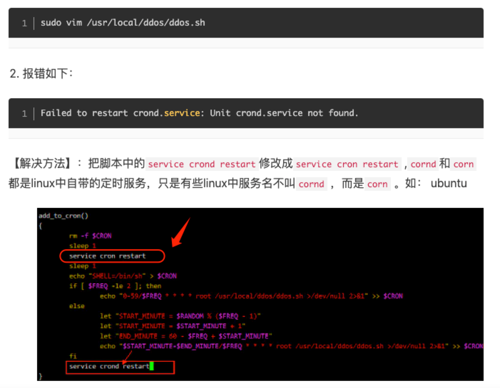

# Linux Crontab定时任务

https://wangchujiang.com/linux-command/c/crontab.html#!kw=

linux内置的cron进程能帮我们实现这些需求，cron搭配shell脚本，非常复杂的指令也没有问题。

### cron介绍

我们经常使用的是crontab命令是cron table的简写，它是cron的配置文件，也可以叫它作业列表，我们可以在以下文件夹内找到相关配置文件。

- /var/spool/cron/ 目录下存放的是每个用户包括root的crontab任务，每个任务以创建者的名字命名
- /etc/crontab 这个文件负责调度各种管理和维护任务。
- /etc/cron.d/ 这个目录用来存放任何要执行的crontab文件或脚本。
- 我们还可以把脚本放在/etc/cron.hourly、/etc/cron.daily、/etc/cron.weekly、/etc/cron.monthly目录中，让它每小时/天/星期、月执行一次。

### crontab的使用

我们常用的命令如下：

```
crontab [-u username]　　　　//省略用户表表示操作当前用户的crontab
    -e      (编辑工作表)
    -l      (列出工作表里的命令)
    -r      (删除工作作)
```

我们用**crontab -e**进入当前用户的工作表编辑，是常见的vim界面。每行是一条命令。

crontab的命令构成为 时间+动作，其时间有**分、时、日、月、周**五种，操作符有

- ***** 取值范围内的所有数字
- **/** 每过多少个数字
- **-** 从X到Z
- **，**散列数字

------

### 实例


##### 实例1：每1分钟执行一次myCommand

```
* * * * * myCommand
```

##### 实例2：每小时的第3和第15分钟执行

```
3,15 * * * * myCommand
```

##### 实例3：在上午8点到11点的第3和第15分钟执行

```
3,15 8-11 * * * myCommand
```


### 查看 定时任务 crontab 日志记录

```
 /var/log/cron.log
```

```
tail -f /var/log/cron
```

看 /var/log/cron.log这个文件就可以，可以用 tail -f /var/log/cron 观察

https://blog.csdn.net/whatday/article/details/107109508

#### 注意：

```
如果系统没有开启（系统默认不开启）crontab 日志，则需要手动编辑 sudo vi /etc/rsyslog.d/50-default.conf 文件，取消cron的注释，然后重启 服务 sudo service rsyslog restart
```


### 重启服务cron：

```
service cron restart
```

### /dev/null 2>&1什么意思

```
" >/dev/null 2>&1 "常用来避免shell命令或者程序等运行中有内容输出。
```

### ==查看所有用户的定时任务==

```
cat /etc/passwd | cut -f 1 -d : |xargs -I {} crontab -l -u {}
```

查看文件的最后操作时间：

```
stat filename
```


## ddos deflate 安装使用详解（防御DDos攻击）

https://www.jianshu.com/p/f1e44408c195

```
crontab -l 也无法查看到此定时任务
```

注意：



