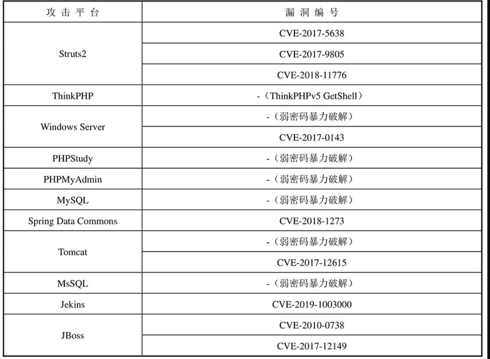
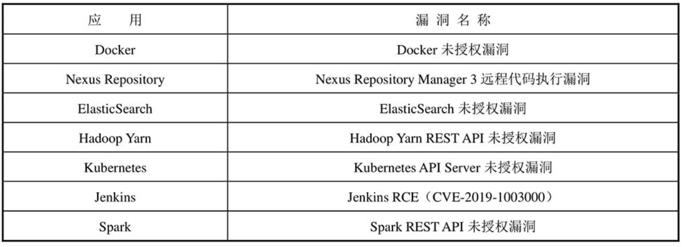
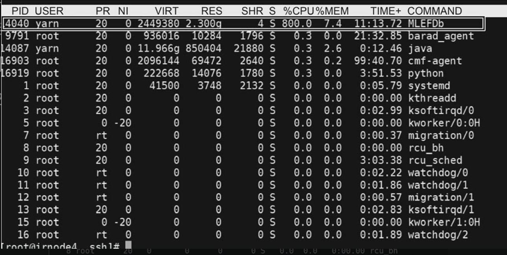
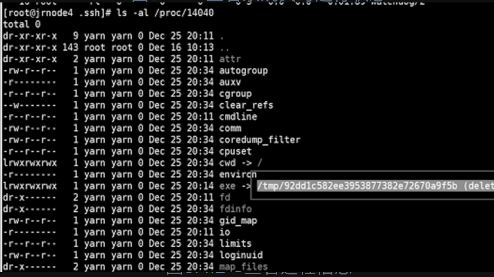
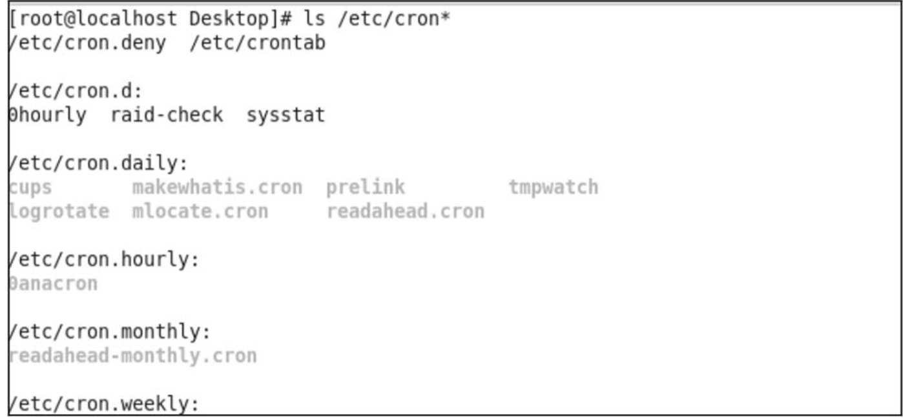
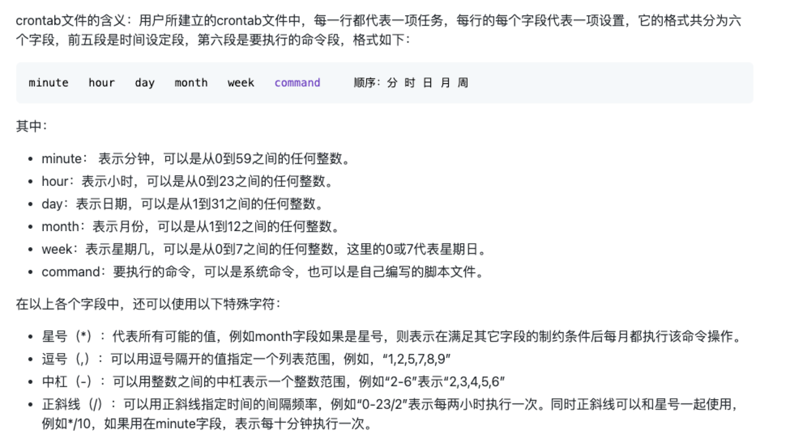

## 5.1挖矿密码概述

挖矿的英语为Mining，早期主要与比特币相关。用户使用个人计算机下载软件，然后运行特定算法，与远方服务器通信后可得到相应比特币。挖矿就是利用比特币挖矿机赚取比特币。挖矿木马是利用各种方法入侵计算机，利用被入侵计算机的算力挖掘加密数字货币以牟取利益的木马。其既可以是一段自动化扫描、攻击的脚本，也可以集成在单个可执行文件中。挖矿木马为了能够长期在服务器中驻留，会采用多种安全对抗技术，如修改任务计划、修改防火墙配置、修改系统动态链接库等，使用这些技术手段严重时可能造成服务器业务中断。

### 挖矿木马传播方法：

1）利用漏洞传播

2）利用弱密码暴力破解传播

3）通过僵尸网络传播

4）采用无文件攻击方法传播

5）利用网页挂马传播

6）利用软件供应链攻击传播

7）利用社交软件、邮件传播

8）内部人员私自安装挖矿程序

### 挖矿木马利用的常见漏洞：





### 5.2常规处置方法

1）查看系统实时运行状态：

```
top
```



2）定位恶意进程，上图进程14040CPU占用率过高，确定为恶意进程

3）查看进程信息

```
ls -al /proc/PID
```



4)结束恶意进程、删除恶意文件

```
kill -9 PID
```

```
rm -rf fileName(文件夹名或者文件名都行)
```

5）查看是否有定时任务并删除

```
crontabl -l 查看当前用户的定时任务
crontab -u user -l 查看用户名为user的定时任务
crontab -r 删除所有的定时任务，如果只想删除特定的定时任务，可以删除定时任务文件中的对应行
```

一般在Linux系统中的任务计划文件是以cron开头的，可以利用正则表达式的*筛选出etc目录下的所有以cron开头的文件，具体表达式为/etc/cron*。例如，查看etc目录下的所有任务计划文件就可以输入【ls /etc/cron*】命令，如图所示：



