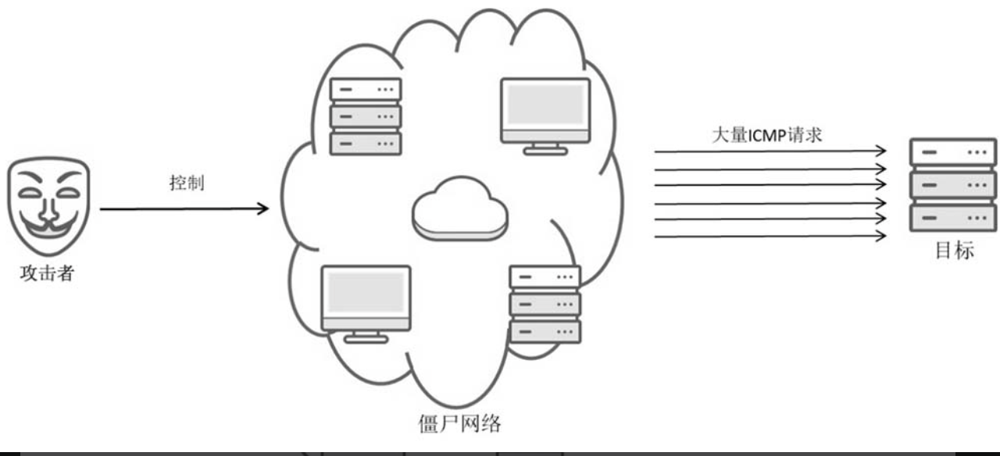
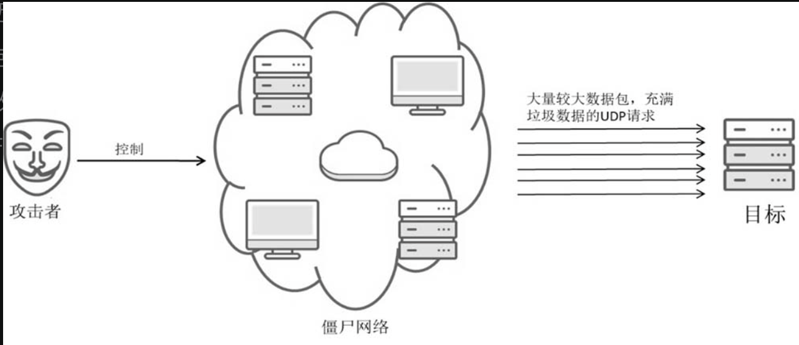
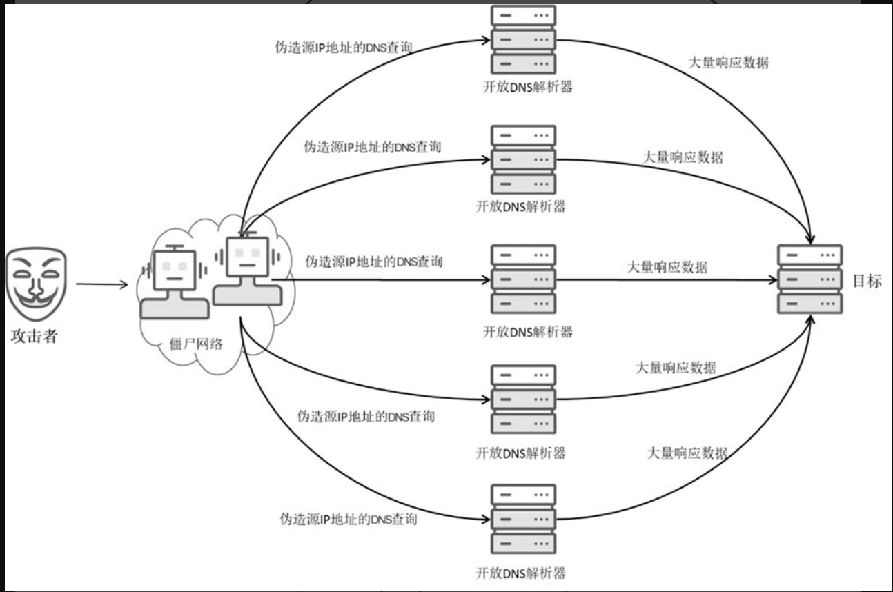
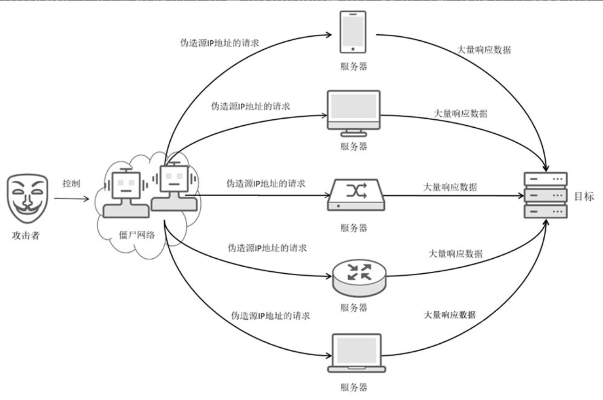
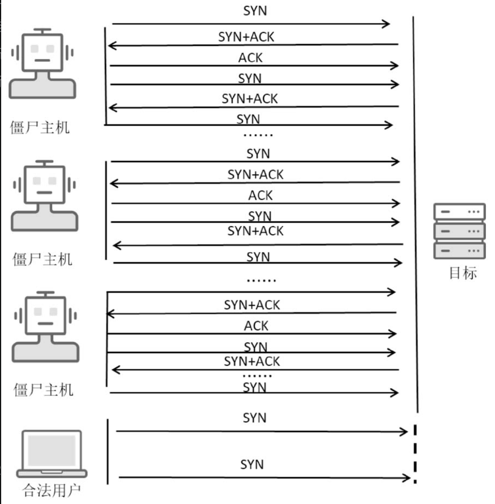
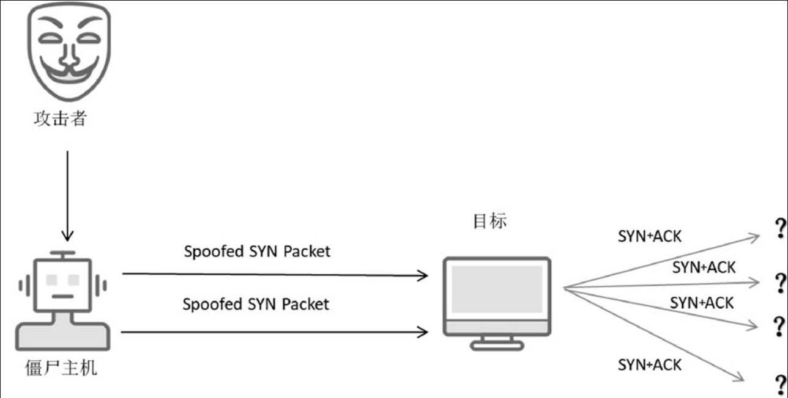
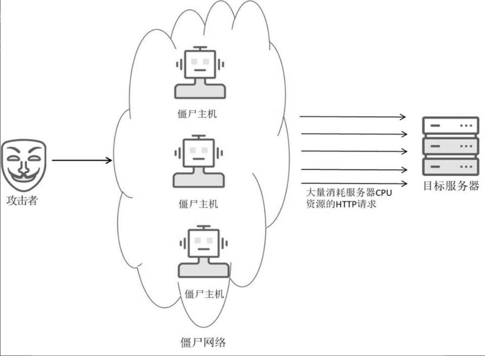

## 第8章　DDoS攻击网络安全应急响应

#### 8.1　DDoS攻击概述

##### 8.1.1　DDoS攻击简介

DDoS攻击是Distributed Denial of Service Attack（分布式拒绝服务攻击）的缩写。在介绍DDoS攻击前，首先要了解了一下DoS攻击（Denial of ServiceAttack）。DoS表示信息技术中实际上应可用的因特网服务的不可用性，最常见的是数据网络拥塞。这可能是无意造成的，也可能是由于服务器或数据网络其他组件受到集中攻击而引起的。而分布式拒绝服务攻击是一种大规模的DoS攻击，攻击者使用多个IP地址或计算机对目标进行攻击。

绝大部分的DDoS攻击是通过僵尸网络产生的。僵尸网络主要由受到僵尸程序感染的计算机及其他机器（如IoT设备、移动设备等）组成，往往数量庞大且分布广泛。僵尸网络采用一对多的控制方法进行控制。当确定受害者的 IP 地址或域名后，僵尸网络控制者发送攻击指令，随后就可以使网络断开连接，指令在僵尸程序间自行传播和执行，每台僵尸主机都将做出响应，同时向目标主机发送请求，可能导致目标主机或网络出现溢出，从而拒绝服务。

##### 8.1.2　DDoS攻击目的

###### 1.进行勒索

攻击者通过对因提供网络服务而赢利的平台（如网页游戏平台、在线交易平台、电商平台等）发起DDoS攻击，使得这些平台不能被用户访问，进而提出交付赎金才停止攻击的要求。

###### 2.打击竞争对手 

攻击者会雇佣犯罪人员，在重要时段打击竞争对手，使对方声誉受到影响或重要活动终止。

###### 3.报复行为或政治目的

攻击者为报复和宣扬政治行为，实施DDoS攻击。

##### 8.1.3　常见DDoS攻击方法

DDoS攻击通过利用分布式的客户端，向攻击目标发送大量看似合法的请求，耗尽目标资源，从而造成目标服务不可用。常见的DDoS攻击方法主要包括：消耗网络带宽资源、消耗系统资源、消耗应用资源。

###### 1.消耗网络带宽资源

攻击者主要利用受控主机发送大量的网络数据包，占满攻击目标的带宽，使得正常请求无法达到及时有效的响应。

1）ICMP Flood（ICMP洪水攻击）

ICMP是Internet Control Message Protocol（网络控制消息协议）的缩写，是TCP/IP协议簇的一个子协议，主要用于在IP主机、路由器之间传递控制消息，进行诊断或控制，以及响应IP操作中的错误。

ICMP Flood 是指攻击者通过受控主机（僵尸网络）向目标发送大量的ICMP请求，以消耗目标的带宽资源，ICMP Flood攻击原理如图所示。

2）UDP Flood（UDP洪水攻击）

UDP Flood是目前主要的DDoS攻击手段，攻击者通过受控主机向目标发送大量的UDP请求，以达到拒绝服务器的目的。通常，攻击者会使用小包和大包的攻击方法。小包是指以太网传输数据值最小数据包，即64字节的数据包。在相同流量中，数据包越小，使用数量也就越多。同时，由于网络设备需要对数据包进行检查，因此使用小包可增加网络设备处理数据包的压力，容易产生处理缓慢、传输延迟等拒绝服务效果。大包是指大小超过了以太网最大传输单元（MTU）的数据包，即1500字节以上的数据包。使用大包攻击能够严重消耗网络带宽资源。在接收到大包后需要进行分片和重组，因此会消耗设备性能，造成网络拥堵。UDPFlood攻击原理如图所示。

3）反射与放大攻击

反射攻击的原理是：攻击者并不直接攻击目标，而是利用互联网的某些特殊服务开放的服务器、路由器等设备（称为反射器），发送伪造请求。通过反射器对请求产生应答，反射攻击流量，同时达到隐藏攻击源的目的。由于攻击中涉及众多反射器的攻击形式，因此也称为分布式反射拒绝服务攻击（Distributed RefectionDenial of Service，DRDoS）。

在进行反射攻击时，攻击者通过控制受控主机，发送大量目标IP指向作为反射器的服务器、路由器的数据包，同时将源IP地址伪造成攻击目标的IP地址。反射器在收到伪造的数据包时，会认为是攻击目标发送的请求，并发送响应的数据包给攻击目标。此时会有大量的响应数据包反馈给攻击目标，造成攻击目标带宽资源耗尽，从而产生拒绝服务。

发动反射攻击需要将请求数据包的源IP伪造成攻击目标的IP地址，这就需要使用无认证或者握手过程的协议。由于UDP协议面向无连接性的协议，与TCP相比，其需要更少的错误检查和验证，因此，大部分的反射攻击都是基于UDP协议的网络服务进行的。

放大攻击的原理是：利用请求和响应的不平衡性，以及响应包比请求包大的特点（放大流量），伪造请求包的源IP地址，将响应包引向攻击目标。结合反射攻击原理，如果反射器能够对网络流量进行放大，那么也可称这种反射器为放大器。

放大攻击的方法与反射攻击基本一致，但是造成的威胁是巨大的。放大攻击的规模和严重程度取决于放大器的网络服务部署的广泛性。如果某些网络服务不需要验证并且效果比较好，那么在互联网上部署的数量就会比较多，利用该服务进行攻击就能达到明显消耗带宽的效果。

常见的DRDoS攻击如下。

（1）NTP Refection Flood。

NTP是Network Time Protocol（网络时间协议）的缩写，指使用一组分布式客户端和服务器来同步一组网络时钟的协议。使用UDP协议，服务端口为123。

标准NTP服务提供了一个monlist功能，也被称为mon_getlist，该功能主要用于监控NTP服务器的服务状况。某些版本NTP的服务器默认开启monlist命令功能，这条命令的作用是向请求者返回最近通过NTP协议与本服务器进行通信的IP地址列表，最多支持返回600条记录。也就是说，如果一台NTP服务器有超过600个IP地址使用过它提供的NTP服务，那么通过一次monlist请求，将收到600条记录的数据包。由于NTP服务使用UDP协议，因此攻击者可以伪造源发地址发起monlist请求，这将导致NTP服务器向被伪造的目标发送大量的UDP数据包，理论上这种恶意导向的攻击流量可以放大到伪造查询流量的100倍，并且该服务器的NTP服务在关闭或重启之前会一致保持这样的放大倍数。NTP Refection Flood攻击原理如图8.1.3所示。

（2）DNS Refection Flood。

DNS是Domain Name System（域名解析系统）的缩写，是许多基于IP网络的最重要的服务之一，它主要用于域名与IP地址的相互转换，使用户可以更方便地访问互联网，而不用去记住机器读取的IP数据串。DNS请求通常通过UDP端口53发送到名称服务器。如果未使用扩展DNS（EDNS），则DNS-UDP数据包允许的最大长度为512字节

通常，DNS的响应数据包比查询数据包大，因此攻击者通过普通的DNS查询就能发动放大攻击，将流量放大。

攻击者会将僵尸网络中的被控主机伪装成被攻击主机，设置特定的时间点连续向多个允许递归查询的DNS服务器发送大量DNS服务请求，然后让其提供应答服务，应答数据经DNS服务器放大后发送到被攻击主机，形成大量的流量攻击。

攻击者发送的DNS查询数据包的大小一般为60字节左右，而查询返回的数据包的大小通常在3000字节以上，因此放大倍数能够达到50倍以上，放大效果是惊人的。DNS Refection Flood攻击原理如图所示。

（3）SSDP Refection Flood。

SSDP是Simple Service Discovery Protocol（简单服务发现协议）的缩写，即一种应用层协议，是构成通用即插即用（UPnP）技术的核心协议之一。互联网中的家用路由器、网络摄像头、打印机、智能家电等设备，普遍采用UPnP作为网络通信协议。SSDP通常使用UDP端口1900。

利用SSDP进行反射攻击的原理与利用DNS、NTP的类似，都是通过伪造攻击者的IP地址向互联网中的大量智能设备发起SSDP请求，接收到请求的智能设备根据源IP地址返回响应数据包。SSDP Refection Flood攻击原理如图所示。

（4）SNMP Refection Flood。

SNMP是Simple Network Management Protocol（简单网络管理协议）的缩写，主要用于网络设备的管理。由于SNMP简单可靠，因此受到众多厂商的欢迎，成为目前使用最为广泛的网络管理协议。

由于众多网络设备的使用，因此在各种网络设备中都能看到默认启用的SNMP服务，很多安装SNMP的设备都采用默认通信字符串。攻击者向广泛存在并开启SNMP服务的网络设备发送GetBulk请求，并使用默认通信字符串作为认证凭据，将源IP地址伪造成被攻击者的IP地址，设备在收到请求后会将响应结果发送给被攻击者。大量响应数据涌向目标，造成目标网络的拥堵。

利用SNMP中的默认通信字符串和GetBulk请求，攻击者能够展开有效攻击，SNMP Refection Flood攻击原理如图所示。

##### 2.消耗系统资源

消耗系统资源攻击主要通过对系统维护的连接资源进行消耗，使其无法正常连接，以达到拒绝服务器的目的。此类攻击主要是因TCP安全性设计缺陷而引起的。

TCP是Transmission Control Protocol（传输控制协议）的缩写，是一种面向连接的、可靠的、基于字节流的传输层通信协议。TCP是在不可靠的互联网络上提供可靠的端到端字节流的传输协议。

TCP工作包括三个阶段：建立连接、数据传输、终止连接。由于协议在最初的设计过程中没有对安全性进行周密考虑，因此在协议中存在安全缺陷。

###### 1）TCP Flood

在建立连接时，TCP使用三次握手协议建立连接，TCP三次握手的过程如下：

客户端发送SYN（SEQ=x）报文给服务器端，进入SYN_SEND状态。

服务器端收到SYN报文，回应一个SYN（SEQ=y）+ACK（ACK=x+1）报文，进入SYN_RECV状态。

客户端收到服务器端的SYN报文，回应一个ACK（ACK=y+1）报文，进入ESTABLISHED状态。

在这个过程中，服务请求会建立并保存TCP连接信息，通常保存在连接表内，但是这个表是有大小限制的，一旦服务器接收的连接数超过了连接表的最大存储量，就无法接收新的连接，从而达到拒绝服务的目的。TCP Flood攻击原理如图所示。

###### 2）SYN Flood

在三次握手过程中，如果在服务器端返回SYN+ACK报文后，客户端由于某些原因没有对其进行确认应答，那么服务器端会进行重传，并等待客户端进行确认，直到TCP连接超时。SYN Flood 将这种等待客户端确认的连接状态称为半开连接。SYN Flood 正是利用了TCP 半开连接的机制发动攻击的。

通过受控主机向目标发送大量的TCP SYN报文，使服务器打开大量的半开连接，由于连接无法很快结束，因此连接表将被占满，无法建立新的TCP连接，从而影响正常业务连接的建立，造成拒绝服务。

攻击者会将SYN报文的源IP地址伪造成其他IP地址或不存在的IP地址，这样被攻击者会将应答发送给伪造地址，占用连接资源，同时达到隐藏攻击来源的目的。SYNFlood攻击原理如图所示。

##### 3.消耗应用资源

消耗应用资源攻击通过向应用提交大量消耗资源的请求，以达到拒绝服务的目的。

###### 1）HTTP Flood（CC攻击）

攻击者利用受控主机对目标发起大量的HTTP请求，要求Web服务器进行处理，超量的请求会占用服务器资源，一旦目标请求饱和，并且无法响应正常流量，就会造成了拒绝服务攻击。

HTTP Flood攻击有以下两种类型。

（1）HTTP GET攻击：多台计算机或设备向目标服务器发送图像、文件或某些资产的多个请求，当目标服务器被传入的请求和响应所“淹没”时，来自合法流量源的其他请求将无法得到正常回复。

（2）HTTP POST攻击：在网站上提交表单时，服务器必须处理传入的请求并将数据推送到持久层（通常是数据库）中。与发送POST请求所需的处理能力和带宽相比，处理表单数据和运行必要的数据库命令的过程相对密集。这种攻击利用相对资源消耗的差异，通过向目标服务器发送大量请求的方式，使目标服务器的容量达到饱和并拒绝服务。

HTTP Flood攻击也会引起连锁反应，不仅会直接导致被攻击的Web前端响应缓慢，还会间接攻击到后端业务层逻辑，以及更后端的数据库服务，增大它们的压力，甚至对日志存储服务器也会造成影响。HTTP Flood攻击原理如图所示。

###### 2）慢速攻击

慢速攻击依赖于慢速流量，主要针对应用程序或服务器资源。与传统的攻击不同，慢速攻击所需的带宽非常少，且难以缓解，因为其生成的流量很难与正常流量区分开。由于攻击者不需要很多资源即可启动，因此可以使用单台计算机成功发起慢速攻击。

慢速攻击以Web服务器为目标，旨在通过慢速请求捆绑每个线程，从而防止真正的用户访问该服务。这个过程通过非常缓慢地传输数据来完成，但同时又可防止服务器超时。

##### 8.1.4　DDoS攻击中的一些误区

1.DDoS攻击都是洪水攻击

在DDoS攻击中，绝大多数是通过洪水（Flood）攻击的方法进行的。但通过上述介绍，我们可以知道除了Flood攻击，还有慢速攻击的方法。

Flood攻击一般是通过在一定时间段内，快速、大量地发送请求数据，从而迅速消耗目标资源，达到拒绝服务的效果，方法使用简单、粗暴。而慢速攻击则是通过缓慢、持续地发送请求并且长期占用，逐步对目标资源进行侵占，最终达到拒绝服务的效果。

2.DDoS攻击都是消耗带宽资源的攻击

在DDoS攻击的相关报道中，我们经常会在标题中看到“史上最大流量”“攻击流量达到了××”等字眼，体现攻击之猛烈。这种以攻击流量带宽的大小作为衡量攻击危害程度的说法，通常会误导我们认为DDoS攻击都是消耗带宽资源的攻击。

但通过上述介绍，我们可以知道DDoS攻击除了消耗目标网络带宽资源，还有消耗系统资源和应用资源的方法。同种攻击方法，攻击的流量越大，危害也就越大。而相同攻击流量下，不同攻击方法带来的危害也不尽相同，由此可见攻击的流量大小只是决定DDoS攻击所带来的危害程度的一个方面。

3.增加带宽、购买防御产品能够解决DDoS攻击目前，DDoS攻击无法彻底解决。

增加带宽本质上属于防护的一种退让策略，这种策略还包括网络架构、硬件设备的冗余，以及服务器性能的提升等。如果攻击者的攻击造成的资源消耗不高于当前带宽、设备承载的能力，那么攻击是无效的。然而攻击者的攻击资源一旦超出了当前的承载能力及防御限度，就需要再次采用相同的退让策略进行解决。理论上讲，这类退让策略能够解决DDoS攻击，但企业因受成本、硬件等实际因素的限制，投入不可能无限增加，带宽也不会无限扩大，因此退让策略并不是有效缓解攻击的方法。

##### 8.1.5　DDoS攻击防御方法

对于DDoS攻击的防御，目前还不能做到100%，因为其并不像漏洞那样，通过补丁安装就可以彻底解决。因此，在防御方面我们应尽可能地考虑周全，以下主要介绍防御思路。

###### 1.攻击前的防御阶段

若我们希望能够识别并阻止将要发生或可能发生的DDoS攻击，则需要我们积极主动地对服务器、主机、网络设备等进行安全配置并部署相关安全产品，消除其中可能存在的DDoS安全隐患。

（1）关注安全厂商、国家互联网应急中心（CNCERT）等机构发布的最新安全通告，及时对攻击设置针对性防护策略。

（2）在条件允许的情况下部署相关设备，例如，部署负载均衡和多节点，服务采用集群；部署抗DDoS设备；部署流量监控设备，并结合威胁情报，对异常访问源进行预警；采用CDN服务。

（3）服务器禁止开放与业务无关的端口，并在防火墙上过滤不必要的端口。

（4）保证充足的带宽。

（5）合理优化系统，避免系统资源浪费。

（6）对特定的流量进行限制。

（7）对服务器定期排查，防止其被攻击利用，成为攻击者的工具。

###### 2.攻击时的缓解阶段

当遭受攻击时，通常会采取各种措施减小DDoS攻击造成的影响，尽量保证业务的可用性，必要时上报公安机关。

（1）根据相关设备或通过对流量的分析，确认攻击类型，在相关设备上进行防护策略调整。

（2）可以根据设备、服务器连接记录，限制异常访问。

（3）若攻击流量超过本地最大防御限度，则可以接入运营商或CDN服务商，对流量进行清洗。

###### 3.攻击后的追溯总结阶段

当攻击得到缓解或结束后，进入追溯总结阶段。相关人员应对遭受的攻击进行分析总结，完善防御机制。

（1）保存、分析攻击期间的日志，整理攻击IP地址，方便后续追溯。

（2）若攻击对业务造成严重影响，则需及时上报公安机关，并尽力追溯攻击者，打消其嚣张气焰。

（3）总结应急响应过程中的问题，对系统网络进行加固，并完善应急流程。

## 8.2　常规处置方法

#### 8.2.1　判断DDoS攻击的类型

如果有抗DDoS攻击设备、流量监控设备等，那么我们可以分析设备的流量、告警信息，判断攻击类型；如果没有相关设备，那么我们可以通过抓包、排查设备访问日志信息，判断攻击类型，为采取适当的防御措施提供依据。

#### 8.2.2　采取措施缓解

确认攻击类型后，我们可以针对当前攻击流量限制访问速率，调整安全设备的防护策略。通过设备的记录信息，对访问异常的IP地址进行封堵。如果流量远远超出出口带宽，建议联系运营商进行流量清洗。

#### 8.2.3　溯源分析

溯源分析一般是通过查看安全设备、流量监控设备、服务器、网络设备上保留的日志信息进行的。但由于攻击者多采用僵尸网络发起攻击，因此溯源工作挑战较大。当我们遭遇攻击时，应保留相关证据，及时报案。

#### 8.2.4　后续防护建议

1）服务器防护

（1）应避免非业务端口对外网开放，减少服务器暴露在公网的攻击点。

（2）及时更新安全补丁，避免服务器沦为攻击者攻击的“肉鸡”。

2）网络防护与安全监测

（1）优化网络，利用负载分流保证系统冗余，同时防止单点故障的产生。

（2）限制同时打开数据包的最大连接数。

（3）及时部署流量监控设备或抗DDoS攻击设备，为追踪溯源提供基础支撑。3）应用系统防护对应用代码做好性能优化。