# 第6章　Webshell网络安全应急响应

## 6.1 Webshell概述

webshell就是以[asp](https://baike.baidu.com/item/asp/128906)、[php](https://baike.baidu.com/item/php/9337)、jsp或者cgi等[网页](https://baike.baidu.com/item/网页/99347)文件形式存在的一种代码执行环境，主要用于网站管理、服务器管理、权限管理等操作。使用方法简单，只需上传一个代码文件，通过网址访问，便可进行很多日常操作，极大地方便了使用者对网站和服务器的管理。正因如此，也有小部分人将代码修改后当作后门程序使用，以达到控制网站服务器的目的。 

顾名思义，“web”的含义是显然需要服务器开放web服务，“shell”的含义是取得对服务器某种程度上操作命令。webshell主要用于网站和服务器管理，由于其便利性和功能强大，被特别修改后的webshell也被部分人当作网站后门工具使用。

### 6.1.1　Webshell分类

根据不同的脚本名称划分，常见的Webshell脚本类型有JSP、ASP、PHP等。

#### 1.JSP型Webshell脚本

JSP全称Java Server Pages，是一种动态Web资源的开发技术。JSP是在传统的网页HTML文件（*.htm，*.html）中插入Java程序段（scriptlet）和JSP标记（tag），从而形成JSP文件（*.jsp）。

JSP型Webshell脚本如下：

#### 2.ASP型Webshell脚本

ASP全称Active Sever Page，是服务器开发专用脚本。它可以与数据库和其他程序进行交互，是在IIS中运行的一种程序。ASP型Webshell脚本如下：

#### 3.PHP型Webshell脚本

PHP全称Hypertext Preprocessor，是一种通用开源脚本语言，主要适用于Web开发领域。PHP可支持常见的数据库及操作系统，可快速地执行动态网页。

PHP型Webshell脚本如下：

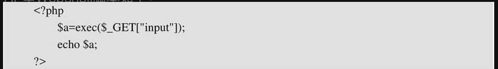

### 6.1.2　Webshell用途

#### 1.站长工具

Webshell的一般用途是通过浏览器来对网站所在的服务器进行运维管理。随着Webshell的发展，其作用演变为在线编辑文件、上传和下载文件、数据库操作、执行命令等。

#### 2.持续远程控制

当攻击者利用漏洞或其他方法完成Webshell植入时，为了防止其他攻击者再次利用，其会修补该网站的漏洞，以达到网站被其单独、持续控制。而Webshell本身所拥有的密码验证可以确保其在未遭受暴力破解工具攻击的情况下，只可能被其上传者利用。

#### 3.权限提升

Webshell的执行权限与Web服务器运行的权限息息相关，若当前Web服务器是root权限，则Webshell也将获得root权限。在一般情况下，Webshell为普通用户权限，此时攻击者为了进一步提升控制能力，会通过设置任务计划、内核漏洞等方法来获取root权限。

#### 4.极强的隐蔽性

部分恶意网页脚本可以嵌套在正常网页中运行，且不容易被查杀。一旦Webshell上传成功，其功能也将被视为所在服务的一部分，流量传输也将通过Web服务本身进行，因此拥有极强的隐蔽性。

### 6.1.3　Webshell检测方法

#### 1.基于流量的Webshell检测

基于流量的Webshell检测方便部署，我们可通过流量镜像直接分析原始信息。基于payload的行为分析，我们不仅可对已知的Webshell进行检测，还可识别出未知的、伪装性强的Webshell，对Webshell的访问特征（IP/UA/Cookie）、payload特征、path特征、时间特征等进行关联分析，以时间为索引，可还原攻击事件。

#### 2.基于文件的Webshell检测

我们通过检测文件是否加密（混淆处理），创建Webshell样本hash库，可对比分析可疑文件。对文件的创建时间、修改时间、文件权限等进行检测，以确认是否为Webshell。

#### 3.基于日志的Webshell检测

对常见的多种日志进行分析，可帮助我们有效识别Webshell的上传行为等。通过综合分析，可回溯整个攻击过程。

### 6.1.4　Webshell防御方法

网页中一旦被植入Webshell，攻击者就能利用它获取服务器系统权限、控制“肉鸡”发起DDos攻击、网站篡改、网页挂马、内部扫描、暗链/黑链植入等一系列攻击行为。因此，针对Webshell的防御至关重要，以下为一些防御方法。

（1）配置必要的防火墙，并开启防火墙策略，防止暴露不必要的服务为攻击者提供利用条件。

（2）对服务器进行安全加固，例如，关闭远程桌面功能、定期更换密码、禁止使用最高权限用户运行程序、使用HTTPS加密协议等。

（3）加强权限管理，对敏感目录进行权限设置，限制上传目录的脚本执行权限，不允许配置执行权限等。

（4）安装Webshell检测工具，根据检测结果对已发现的可疑Webshell痕迹立即隔离查杀，并排查漏洞。

（5）排查程序存在的漏洞，并及时修补漏洞。可以通过专业人员的协助排查漏洞及入侵原因。

（6）时常备份数据库等重要文件。

（7）需要保持日常维护，并注意服务器中是否有来历不明的可执行脚本文件。

（8）采用白名单机制上传文件，不在白名单内的一律禁止上传，上传目录权限遵循最小权限原则。

## 6.2　常规处置方法

网站中被植入Webshell，通常代表着网站中存在可利用的高危漏洞，攻击者利用这些漏洞，将Webshell写入网站，从而获取网站的控制权。一旦在网站中发现Webshell文件，可采取以下步骤进行临时处置。

6.2.1　入侵时间确定

6.2.2　Web日志分析

6.2.3　漏洞分析

6.2.4　漏洞复现

6.2.5　漏洞修复

## 6.3　常用工具

### 6.3.1　扫描工具

#### 1.D盾（Windows）

D盾是目前流行的Web查杀工具，使用方便，包含如下功能：

（1）Webshell查杀、可疑文件隔离；

（2）端口进程查看、base64解码，以及克隆用户检测等；

（3）文件监控。

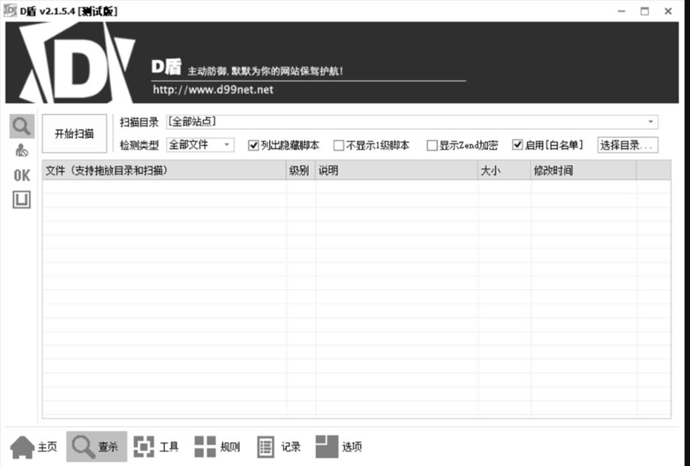

#### 2.河马Webshell查杀（Linux）

河马Webshell查杀拥有海量Webshell样本和自主查杀技术，采用传统特征+云端大数据双引擎的查杀技术，支持多种操作系统。河马Webshell查杀工具截图如图6.3.2所示。

### 6.3.2　抓包工具

Wireshark是一个支持多平台抓包分析的开源软件，可捕获网络流量并进行分析。Wireshark工具截图如图6.3.3所示。

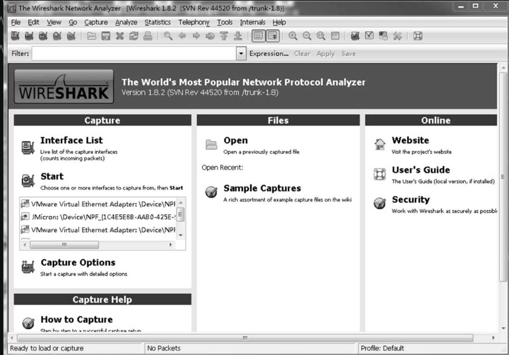

## 6.4　技术操作指南

在应急响应时，首先应判断系统是否存在植入Webshell的可能。根据事件发生的时间进行排查，对攻击路径进行溯源分析。如果网站被植入暗链或出现单击链接跳转到其他网站（如博彩网站、色情网站等）的情况，应首先排查网站首页相关js，查看是否被植入了恶意跳转的js。若网站首页被篡改或有其他被攻击的现象，则应根据网站程序信息，如程序目录、文件上传目录、war包部署目录，使用工具（如D盾）和搜索关键词（如eval、base64_decode、assert）方式，定位到Webshell文件并清除。然后根据日志进行溯源分析，同时除了进行Web应用层排查，还应对系统层进行全面排查，防止攻击者在获取Webshell后执行了其他的权限维持操作。可以从以下几个方向进行初步排查，分别包括Webshell排查、Web日志分析、系统排查、日志排查、网络流量排查。最后进行清除加固。

### 6.4.1　初步预判

#### 1.了解Webshell事件表现

植入Webshell，系统可能出现的异常现象如下：网页被篡改，或在网站中发现非管理员设置的内容；出现攻击者恶意篡改网页或网页被植入暗链的现象；发现安全设备报警，或被上级部门通报遭遇Webshell。如图6.4.1所示，查看网页信息，发现该网页被植入了赌博网站的暗链。

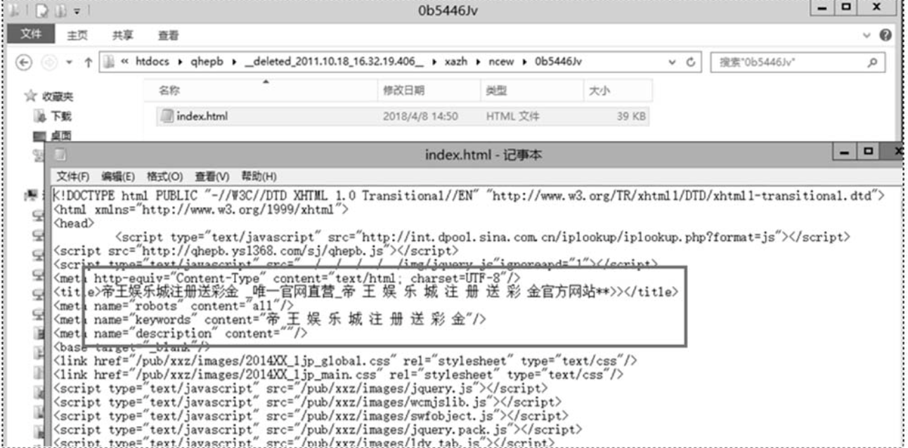如图6.4.2所示，安全设备出现网页后门报警。

#### 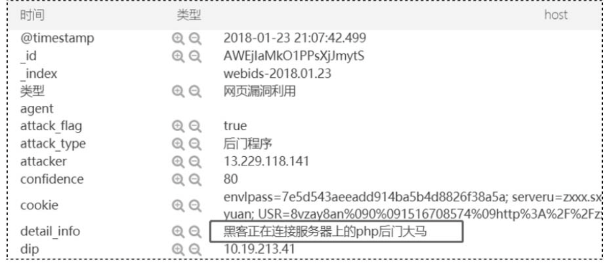2.判断Webshell事件发生时间

根据异常现象发生时间，结合网站目录中Webshell文件的创建时间，可大致定位事件发生的时间段。如图6.4.3所示，Webshell文件的创建时间为2018年11月7日，20：20：24。

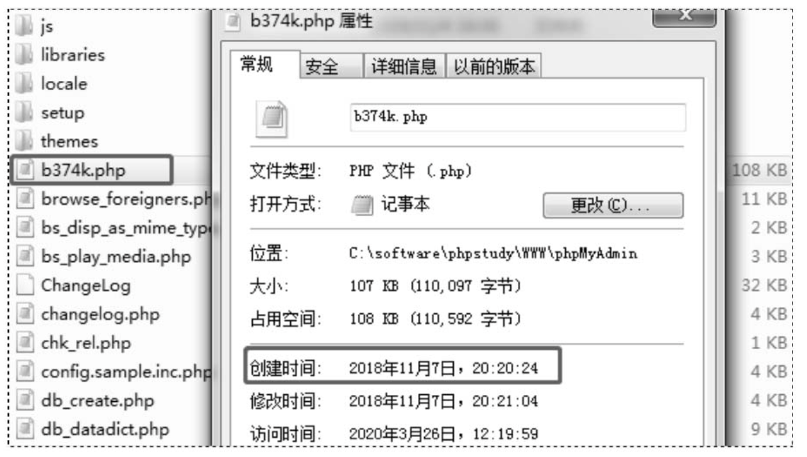

#### 3.判断系统架构

应急响应工程师应收集系统信息，为快速溯源分析提供前期准备工作，可参考表6.4.1中内容，以此定位系统可能存在的漏洞。

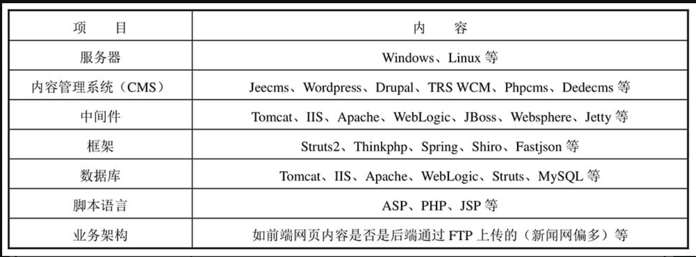

### 6.4.2　Webshell排查

#### 1.Windows系统

排查可利用Webshell扫描工具（如D盾）对应用部署目录进行扫描，如网站D：\WWW\目录，或者将当前网站目录文件与此前备份文件进行比对，查看是否存在新增的不一致内容，确定是否包含Webshell相关信息，并确定Webshell位置及创建时间。D盾扫描出的可疑Webshell文件如图6.4.4所示。

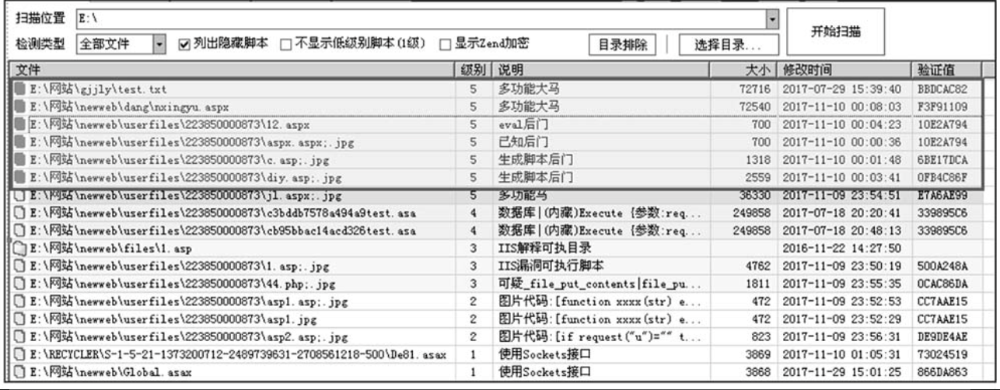

可用文本工具打开发现的可疑文件，查看代码内容，进行进一步确认，如图6.4.5所示。

#### 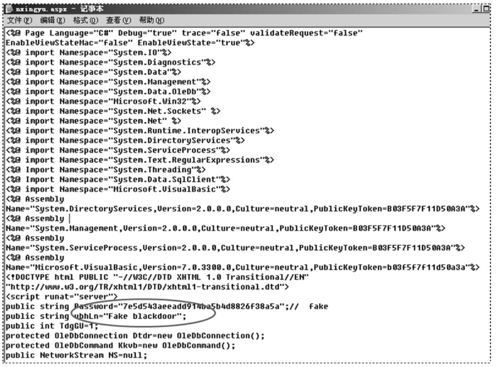2.Linux系统

排查在Windows系统中使用的Webshell检测方法在Linux系统中同样适用。在Linux系统中，可用河马Webshell查杀工具扫描，也可手工搜索可能包含Webshell特征的文件，表6.4.2为常用的搜索命令。

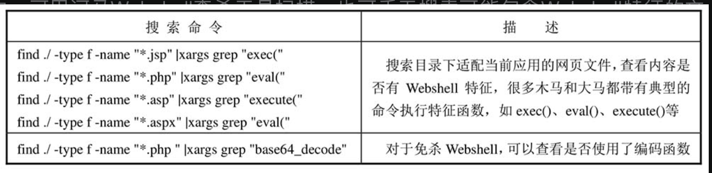使用命令搜索到的包含命令执行参数的可疑Webshell文件“JspSpy.jsp”及“caidaoshell.jsp”如图6.4.6所示

### 6.4.3　Web日志分析

#### 1.Windows系统排查

接下来，需要对Web日志进行分析，以查找攻击路径及失陷原因，常见Web中间件默认路径如表6.4.3所示。

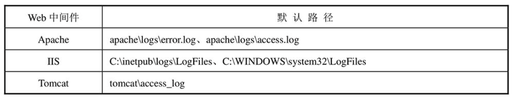

以IIS为例，可以打开【Microsoft日志记录属性】对话框，查看日志文件目录及日志文件名，如图6.4.7所示。

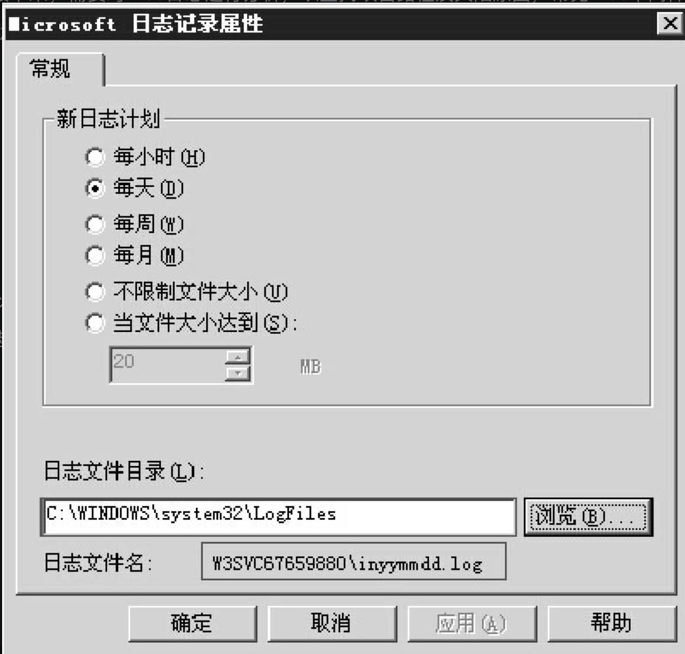

根据Webshell文件创建时间，排查对应时间范围的IIS访问日志，可以发现最早的访问是在2017年11月9日，如图6.4.8所示。

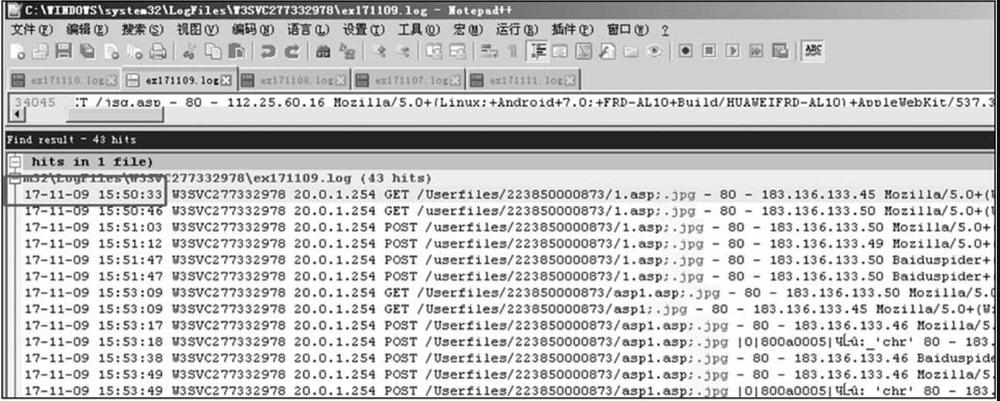

进一步搜索Webshell文件创建时间前后的相关日志，可以看到在访问时间之前有利用POST方法访问Upload_user.aspx上传页面的情况，推断攻击者可能利用Upload_user.aspx页面的文件上传功能上传包含了Webshell的文件，且当前的中间件IIS6存在后缀名解析漏洞，使得文件执行，如图6.4.9所示。

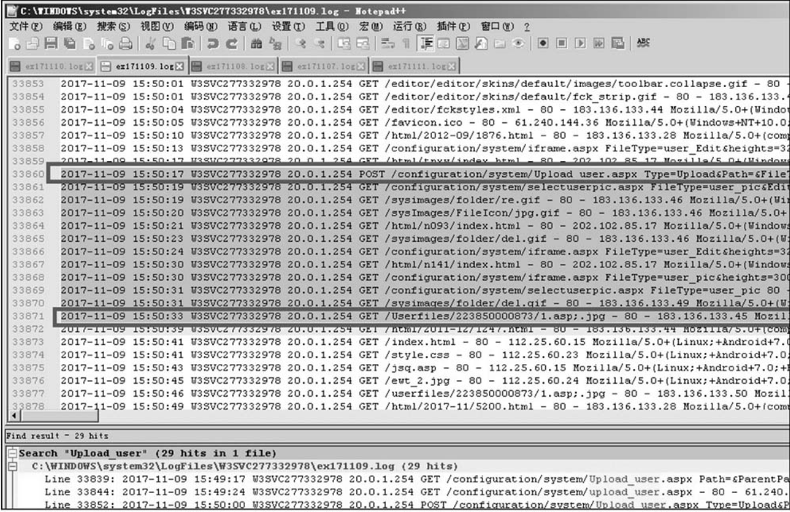进一步分析得知该Upload_user.aspx页面需要登录后台才能访问。从日志中可以发现，攻击者在访问上传页面之前还访问了登录页面，由于Web应用日志默认不记录POST请求体，且通过测试发现网站后台存在弱密码用户，弱密码为123456，因此攻击者可以轻易登录后台，进而利用该上传功能上传Webshell，如图6.4.10所示。

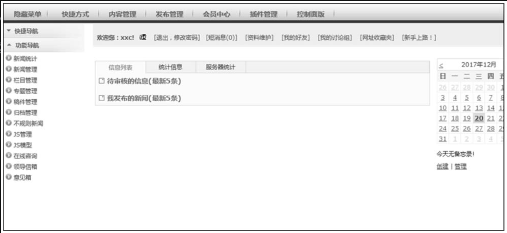因此，通过Web日志分析我们可以大致推断出攻击者的攻击路径及攻击方法。

2.Linux系统排查

在Linux系统中，常见Web中间件默认路径如表6.4.4所示。

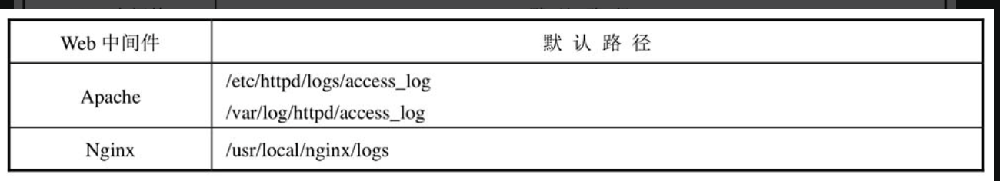可以根据发现Webshell的时间、系统异常的时间或Webshell查杀工具定位到木马的时间对相关时间段日志进行分析。如图6.4.11所示，根据发现Webshell的时间，分析相关时间段日志，发现了攻击者利用Dedecms后台GetShell漏洞上传的Webshell。

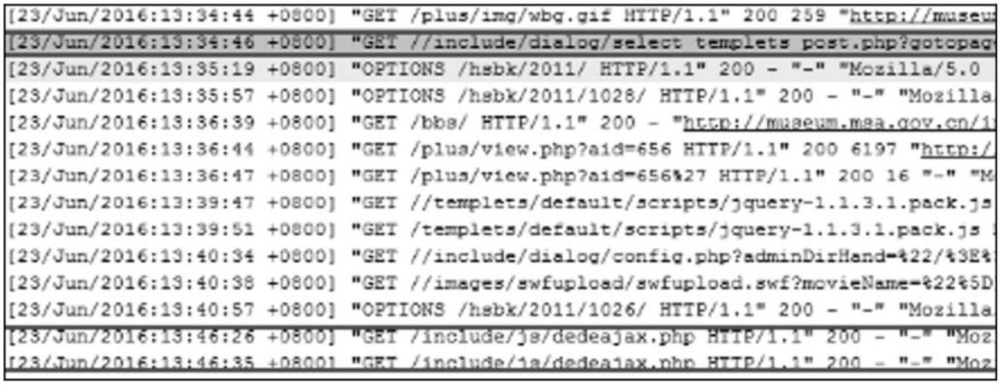

在Linux日志排查时，为方便日志检索及溯源分析，列举了常用日志检索命令，如表6.4.5所示。

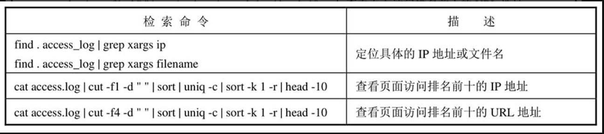

### 6.4.4　系统排查

攻击者上传Webshell后，往往还会执行进一步的操作，如提权、添加用户、写入系统后门等，实现持久化驻留。因此，还需要对系统进行排查，主要排查内容如下。

#### 1.Windows系统排查

#### 2.Linux系统排查

##### 1）用户信息排查

使用【cat/etc/passwd】命令，可查看系统用户信息，与管理员确认是否存在未知新增用户。如图6.4.23所示，发现未知admin用户，具备root权限，因此需要进行重点排查。

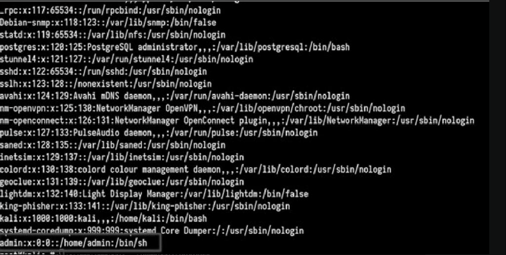排查中需要关注UID为0的用户，因为在一般情况下只有root用户的UID为0，其他用户的UID如果设置为0，即拥有root权限，需要重点排查。但需要注意的是，UID为0的用户也不一定都是可疑用户，如Freebsd默认存在toor用户，且UID为0，toor 在BSD官网的解释为root替代用户，属于可信的。常用的分析可疑用户的命令如表6.4.6所示。

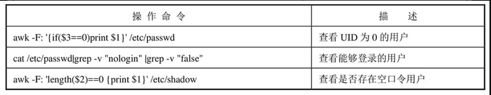可以看到UID为0的用户除了root，还有admin。如果admin是非已知用户，那么极有可能为可疑用户，如图6.4.24所示。

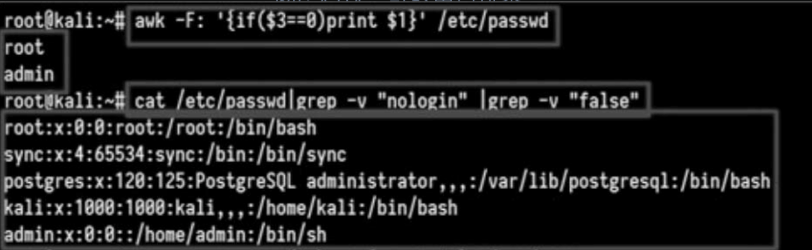2)进程、服务、网络连接排查

（1）在Linux系统中，可以使用【ps aux】命令查看系统进程，如图6.4.25所示

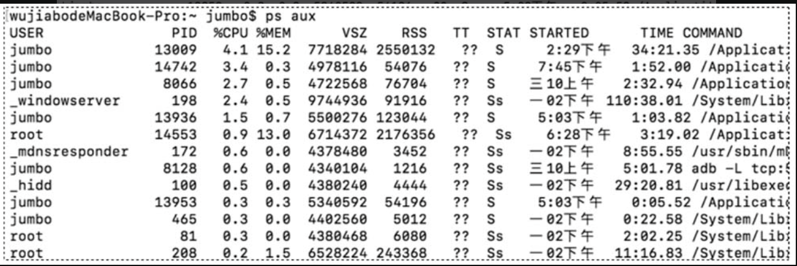其中，USER列表示启动进程的用户名，PID列表示进程的PID值，TIME列表示进程已经运行的时间，COMMAND列表示启动进程的命令。在排查中，应优先关注CPU、内存占用较高的进程。若要强制结束进程，则可以使用【kill-9 PID】命令，如【kill-9 13009】，即可结束PID值为13009的进程。（2)使用【netstat-anp】命令，可查看网络连接、进程、端口及对应的PID等，如图6.4.26所示。排查时可优先关注对外连接的进程，或连接高危端口的进程。

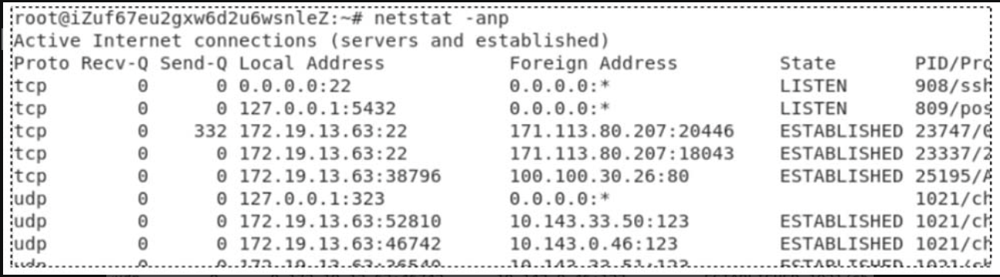

（3）根据PID，使用【ls-alh/proc/PID】命令，可查看其对应的可执行程序。如使用命令【ls-alh/proc/1021】，可查询PID 为1021的可执行程序，发现文件chronyd，如图6.4.27所示。

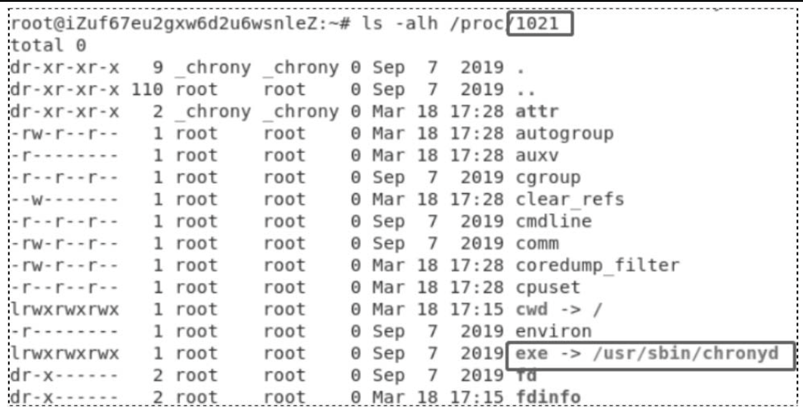

若为恶意进程，可以使用【kill-9 PID】命令结束进程，然后使用【rm-rffilename】命令删除进程。如果root用户都无法删除相关文件，那么很可能是因为文件被加上了i属性（设定文件不能被删除、改名、设定连接关系，同时不能写入或新增内容）。此时，需要使用【lsatter filename】命令查看文件属性，然后使用【chattr-i filename】命令移除i属性，进而删除文件。

（4）也可使用【lsof-p PID】命令查看PID对应的可执行程序。如使用【lsof-p1021】命令，可查询PID为1021的可执行程序，可以得到同样的结果，如图6.4.28所示。

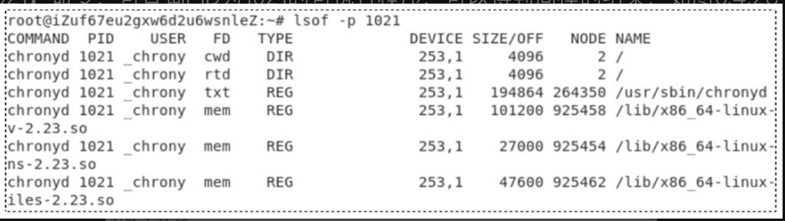

可使用【lsof-i：port】命令查看指定端口对应的可执行程序。如使用【lsof-i：18043】命令，可查询端口为18043的可执行程序，如图6.4.29所示。

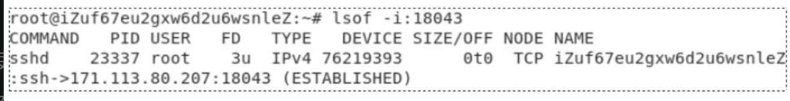

查看指定端口对应的可执行程序使用【top】命令，可以根据CPU、内存占用率查看可疑进程。如图6.4.30所示，该进程占用大量CPU，因此需要进行重点关注与排查。

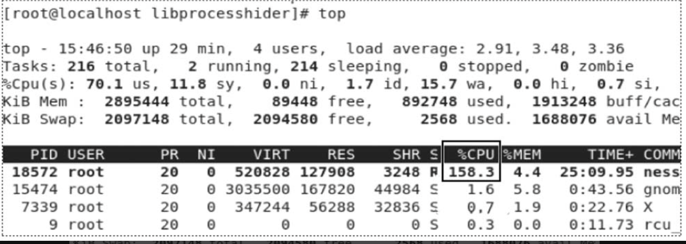进程占用大量CPU

（5）查看隐藏进程。可以借助unhide工具排查隐藏进程。unhide是一个小巧的网络取证工具，能够发现隐藏的进程和TCP/UDP端口。该工具在Linux、UNIX、MS-Windows等操作系统中都可使用。

在CentOS中安装unhide时，首先需要安装epel源（使用命令【yum-y installepel-release】），然后安装unhide（使用命令【yum-y install unhide】）。例如，在应急响应中发现攻击者利用LD_PRELOAD劫持系统函数，将恶意动态链接库路径写入/etc/ld.so.preload（没有则创建）配置文件，使对应的恶意动态链接库文件隐藏。执行【ps】和【top】命令均无法看到恶意进程，但使用【unhideproc】命令可查出隐藏的恶意进程。图6.4.31为执行的恶意程序，图6.4.32为使用【ps】命令查看进程，未发现该恶意进程，图6.4.33为使用unhide工具检测，发现该恶意进程。

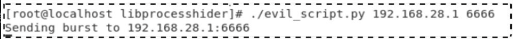

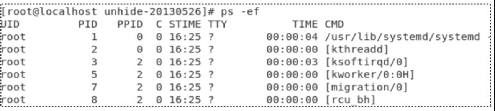

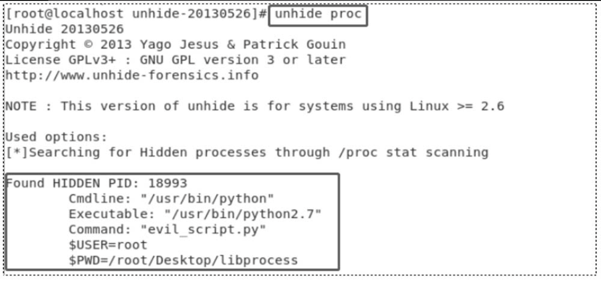

使用【ps】命令查看进程[插图]图6.4.33　使用unhide工具检测（6）使用【chkconfig--list】命令，可查看系统运行的服务，核查是否存在异常服务，如图6.4.34所示。

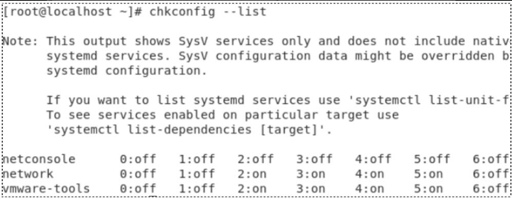

##### 3）开机自启动排查

攻击者在攻击成功后往往会设置开机自启动，以实现持久化控制。在Linux系统中，系统启动内核挂载根文件系统，然后启动并运行一个init程序，init是非内核进程中第一个被启动运行的，因此它的PID的值总是1，init读取其配置文件来进行初始化工作，init程序的配置文件如表6.4.7所示，这里以服务器常用的CentOS操作系统举例。

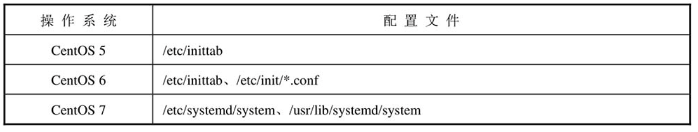

init进程的任务就是运行开机启动的程序，Linux系统为不同的场合分配不同的开机启动程序，又称为“运行级别”（runlevel），如表6.4.8所示。

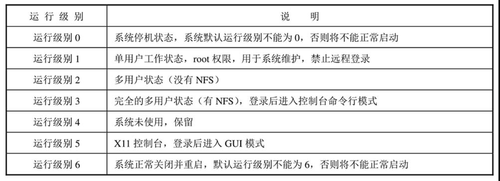

7个运行级别分别对应7个目录，如图6.4.35所示，可以看到/etc目录下的7个文件夹/rc[0-6].d其实就是/rc.d/rc[0-6].d的软链接，目的是保持与UNIX系统的兼容性。

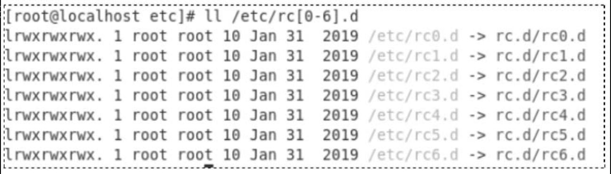

在上述每个目录下有对应的启动文件，图6.4.36为软链接文件，真实文件都存放在/etc/rc.d/init.d/目录中，文件名都是“字母S[K]+两位数字+程序名”的形式。字母S表示Start，也就是启动的意思，字母K表示Kill，也就是关闭的意思。

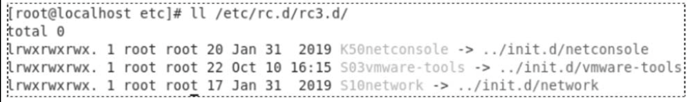

在/etc/rc.d/目录下还有init.d目录和rc.local文件，如图6.4.37所示。init.d目录通常用于存放一些脚本，包括Linux系统中以rpm包安装时设定的一些服务的启动脚本，类似于Windows系统中的注册表；rc.local文件会在用户登录之前读取，在每次系统启动时都会执行一次，也就是说，如果有任何需要在系统启动时运行的工作，那么只需写入/etc/rc.d/rc.local 配置文件即可。

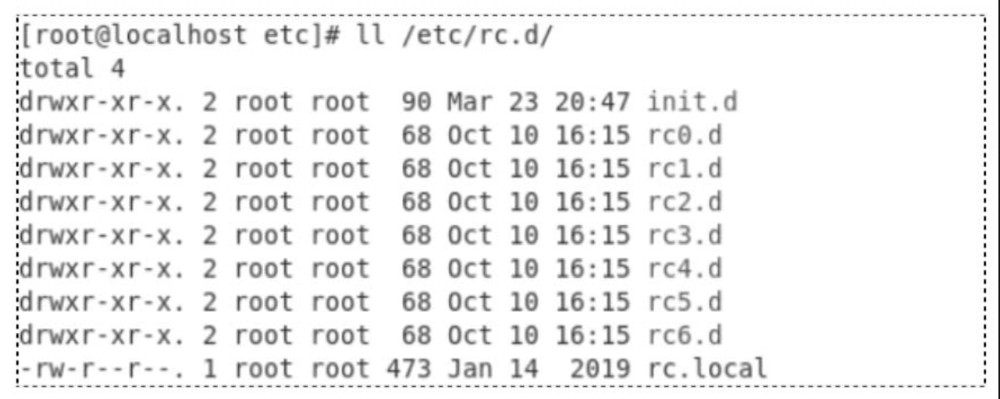

因此，在进行应急响应处置时应重点关注以下目录文件（依系统而定）：

/etc/inittab；

/etc/init/*.conf；

/etc/systemd/system；

/etc/rc.d/rdN.d；

/etc/rc.d/local；

/etc/rc.d/init.d。

##### 4）定时任务排查

在应急响应中，定时任务也是重要的排查点，攻击者通常用其进行持久化控制。一般常用的【crontab-l】命令是用户级别的，保存在/var/spool/cron/{user}中，每个用户都可以使用【crontab-e】命令编辑自己的定时任务列表。而/etc/crontab是系统级别的定时任务，只有root账户可以修改。另外，还需要注意的有/etc/cron.hourly、/etc/cron.daily、/etc/cron.weekly、/etc/cron.monthly等周期性执行脚本的目录。例如，攻击者若想每日执行一个脚本，则只需将脚本放到/etc/cron.daily下，并且赋予执行权限即可。

（1）使用【crontab-l】命令，可查看当前用户的定时任务，检查是否有后门木马程序启动相关信息。如图6.4.38所示，发现存在每隔23分钟向远程网盘下载恶意文件的服务。

2）使用【ls/etc/cron*】命令，可查看etc目录系统级定时任务相关文件。通过排查发现，在cron.hourly目录下存在恶意oanacroner文件，其每小时会从恶意网盘下载恶意文件并执行，如图6.4.39所示。

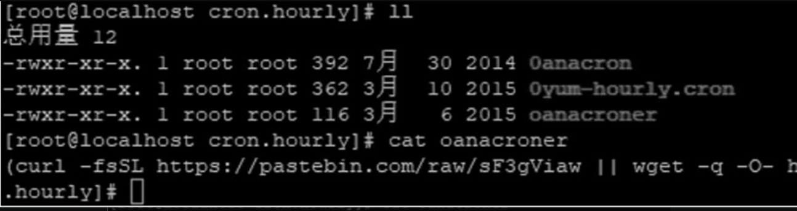

##### 5）rootkit排查

rootkit是一种特殊的恶意软件，功能是在安装目标上隐藏自身及指定的文件、进程和网络连接等信息。rootkit一般会与木马、后门等其他恶意程序结合使用。

（1）在对应目录使用【ls-alt/bin】命令，可查看相关系统命令的修改时间，判断是否有更改，如图6.4.40所示。

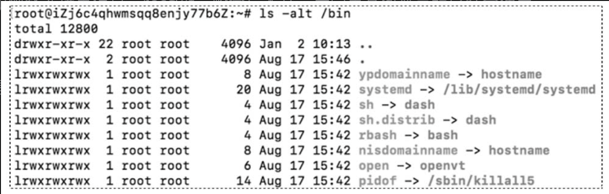

（2）在指定目录使用【ls-alh/bin】命令，可查看相关文件大小，若明显偏大，则很可能被替换，如图6.4.41所示。

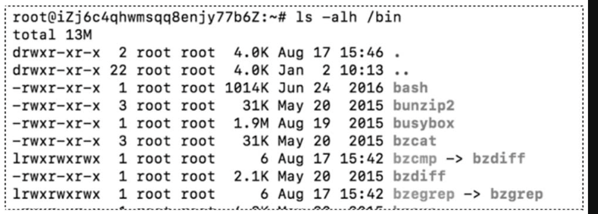

（3）使用【rpm-Va】命令，可查看发生过变化的软件包，若一切校验结果均正常，则不会产生任何输出，图6.4.42是正常的校验结果。

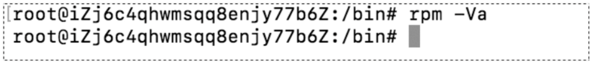

（4）还可以使用第三方查杀工具，如chkrootkit、rkhunter进行查杀。使用chkrootkit，若出现INFECTED，则说明检测出系统后门。使用rkhunter，在出现异常时，会进行标记并突出显示。需要注意的是，在使用前应将工具更新为最新版本。chkrootkit运行结果如图6.4.43所示，rkhunter运行结果如图6.4.44所示。

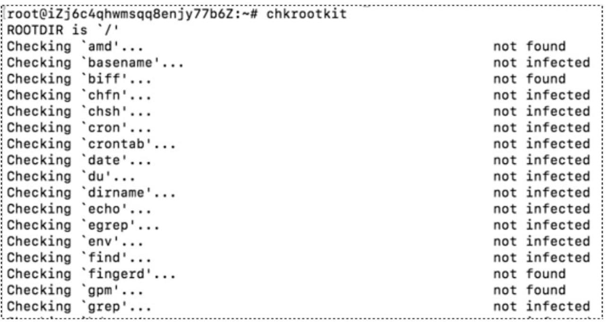

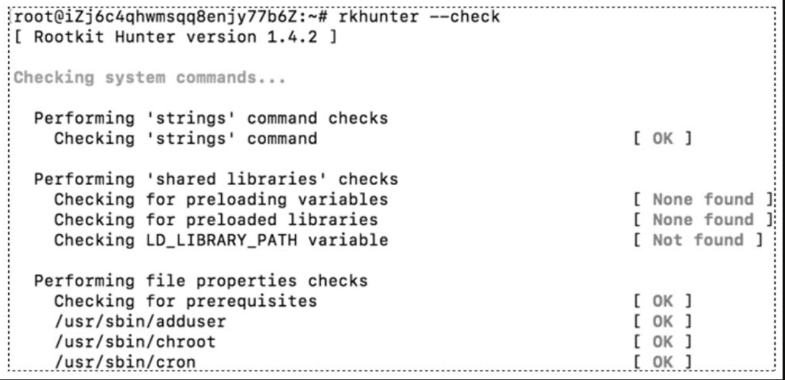

##### 6）文件排查

通过对一些敏感文件及敏感目录的排查，可判断是否存在攻击者的攻击存留文件，以及修改访问过的文件。

（1）使用【ls-al】命令，可查看隐藏的文件，如图6.4.45所示。

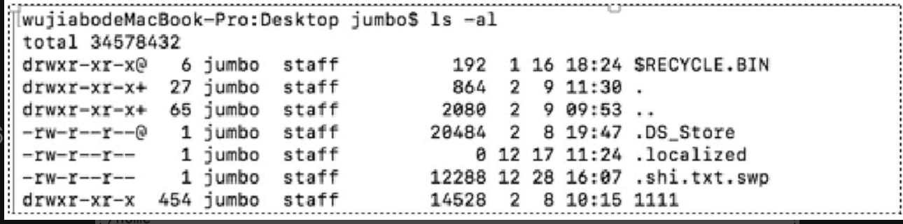

（2）使用【find/-mtime 0】命令，可查看最近24小时内修改过的文件，如图6.4.46所示。

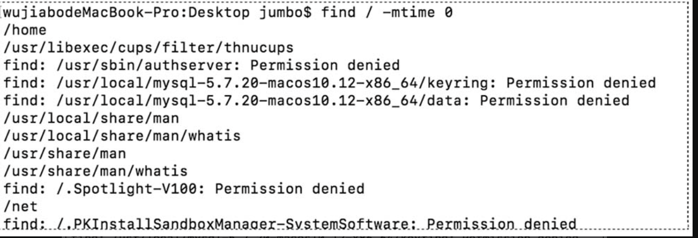

（3）使用【stat filename】命令，可查看文件的修改、创建、访问时间。例如，使用【stat echo】命令，可查看echo文件的相关属性信息，如图6.4.47所示。应重点关注与事件发生时间接近的文件的情况，或者修改、创建、访问时间存在逻辑错误的文件的情况。

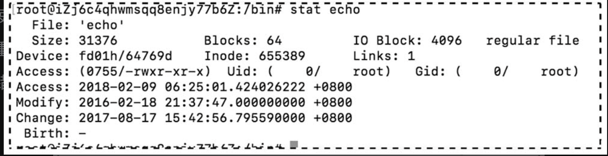

（4）使用【ls-alh/tmp】命令，可查看/tmp目录文件，发现“.beacon”恶意文件，如图6.4.48所示。

（5）使用【ls-alh/root/.ssh/】命令，可查看是否存在恶意的ssh公钥，一旦发现非已知ssh公钥，则很可能是攻击者写入的。如图6.4.49所示，发现在某个kali主机上生成的ssh公钥。

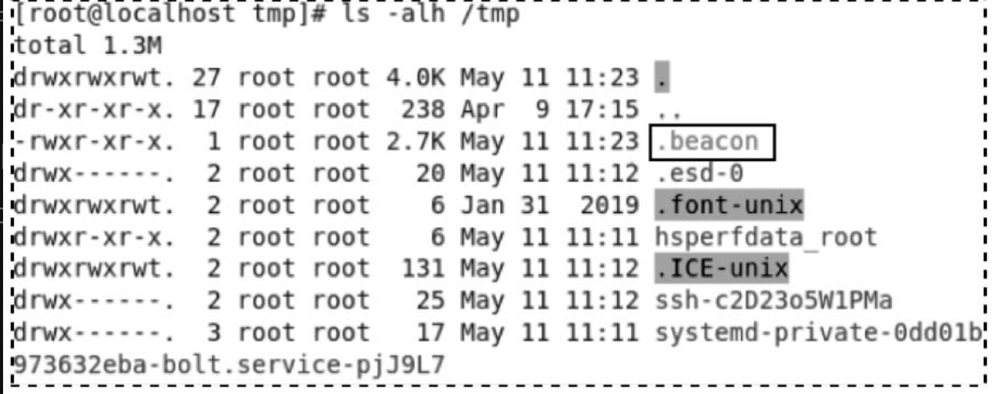

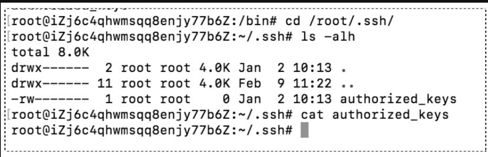