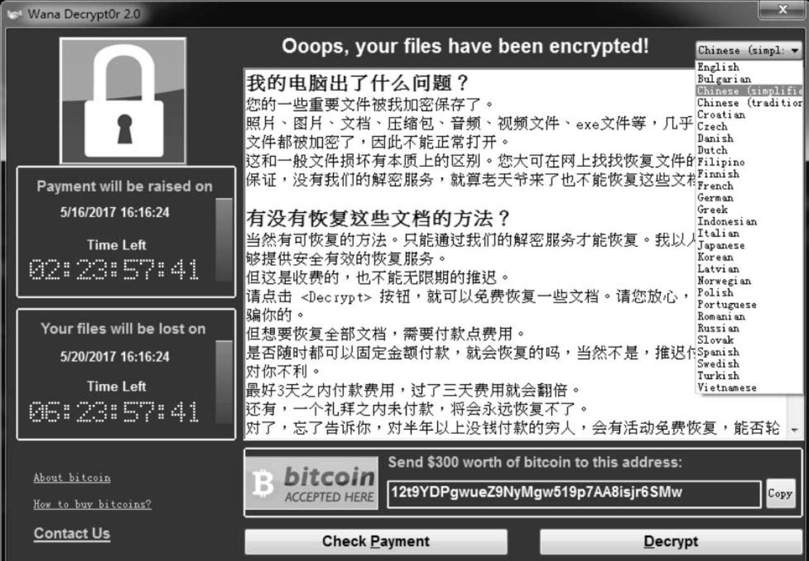
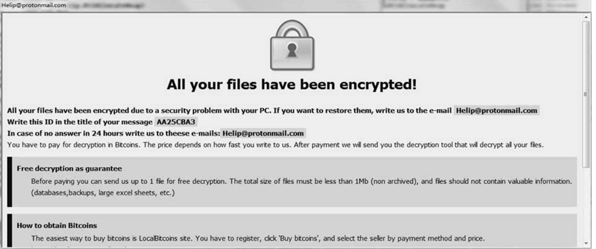
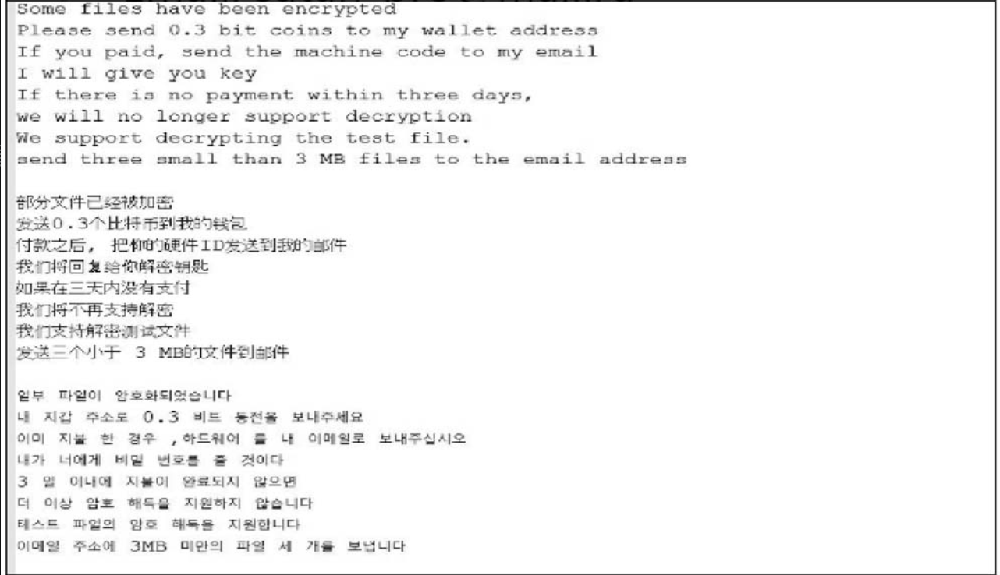
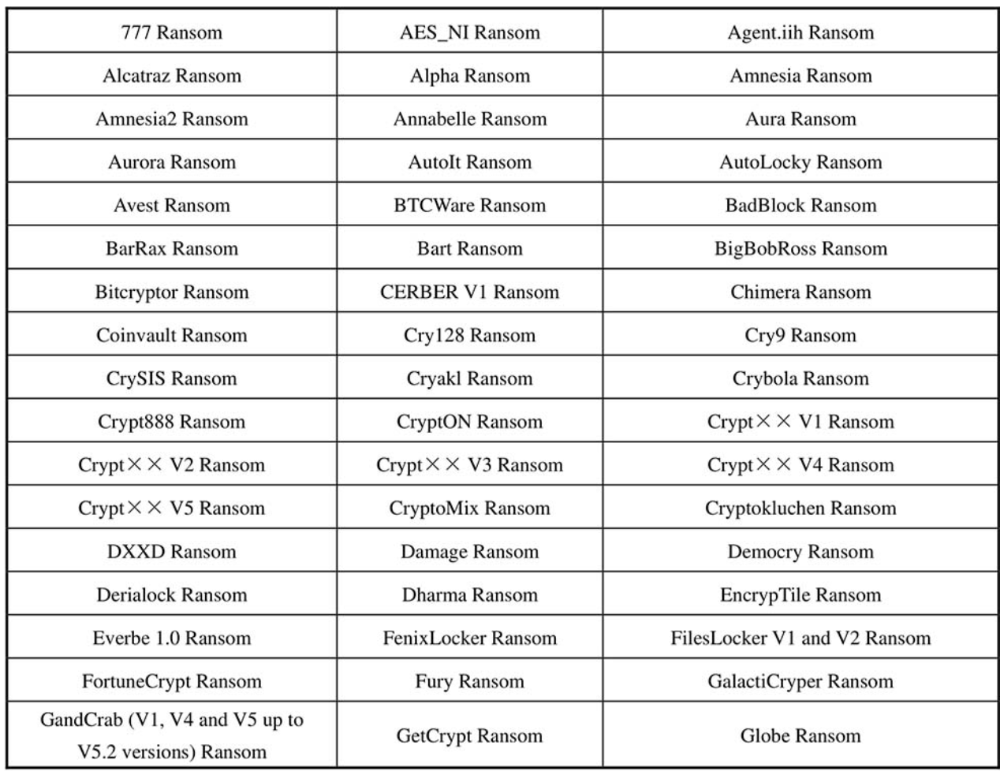
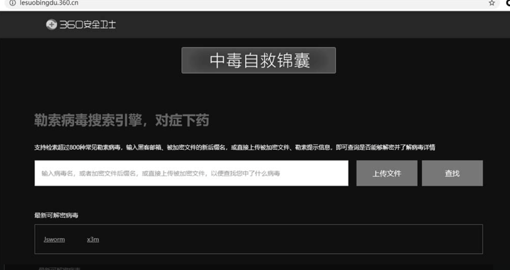
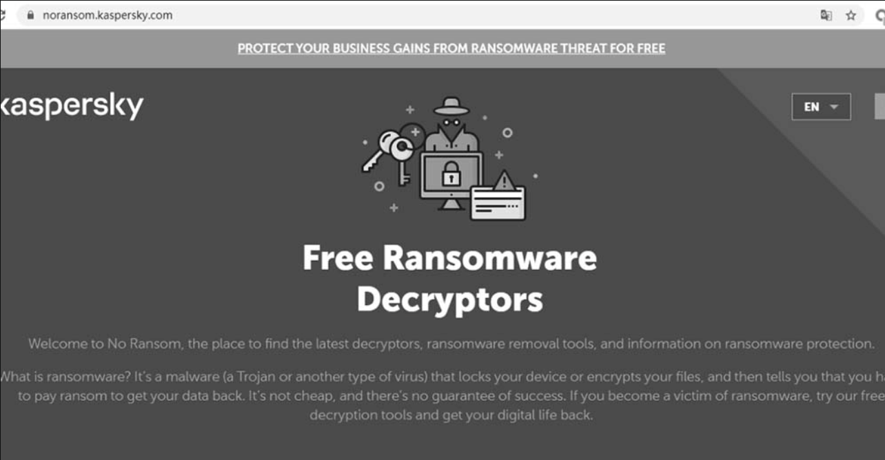

## 4.1　勒索病毒概述

#### 4.1.1　勒索病毒简介

勒索病毒是伴随数字货币兴起的一种新型病毒木马，机器一旦遭受勒索病毒攻击，将会使绝大多数文件被加密算法修改，并添加一个特殊的后缀，且受害者无法读取原本正常的文件，从而造成无法估量的损失。勒索病毒通常利用非对称加密算法和对称加密算法组合的形式来加密文件。绝大多数勒索病毒均无法通过技术手段解密，必须拿到对应的解密私钥才有可能无损还原被加密文件。攻击者正是通过这样的行为向受害者勒索高昂的赎金，这些赎金必须通过数字货币支付，一般无法溯源，因此危害巨大。

#### 4.1.2　常见的勒索病毒

##### 1.WannaCry勒索病毒

2017年5月12日，WannaCry勒索病毒全球大爆发，至少150个国家、30万用户“中招”，造成巨大损失。WannaCry勒索病毒通过MS17-010漏洞在全球范围传播，感染了大量的计算机。该病毒感染计算机后会向计算机植入敲诈者病毒，导致计算机大量文件被加密。受害者计算机被攻击者锁定后，病毒会提示需要支付相应赎金方可解密。WannaCry勒索病毒的勒索信如图4.1.1所示。

（1）常见后缀：wncry。

（2）传播方法：“永恒之蓝”漏洞。

（3）特征：启动时会连接一个不存在的URL（Uniform Resource Locator，统一资源定位符）；创建系统服务mssecsvc2.0；释放路径为Windows目录。

##### 2.GlobeImposter勒索病毒

GlobeImposter勒索病毒于2017年5月首次出现，主要通过钓鱼邮件进行传播。2018年8月21日起，多地发生GlobeImposter勒索病毒事件，攻击目标主要是开启远程桌面服务的服务器，攻击者暴力破解服务器密码，对内网服务器发起扫描并人工投放勒索病毒，导致文件被加密，暂时无法解密。GlobeImposter勒索病毒的勒索信如图所示。

（1）常见后缀：auchentoshan、动物名+4444等。

（2）传播方法：RDP暴力破解、钓鱼邮件、捆绑软件等。

（3）特征：释放在%appdata%或%localappdata%。

##### 3.Crysis/Dharma勒索病毒

Crysis/Dharma勒索病毒最早出现于2016年，在2017年5月其万能密钥被公布之后，消失了一段时间，但在2017年6月后开始继续更新。攻击方法同样是利用远程RDP暴力破解的方法植入到服务器进行攻击。由于Crysis采用AES+RSA的加密方法，因此最新版本无法解密。Crysis/Dharma勒索病毒的勒索信如图所示。

（1）常见后缀：【id】+勒索邮箱+特定后缀。

（2）传播方法：RDP暴力破解。

（3）特征：勒索信位置在startup目录，样本位置在%windir%\system32、startup目录、%appdata%目录。

##### 4.GandCrab勒索病毒

GandCrab勒索病毒于2018年年初面世，仅半年的时间，就连续出现了V1.0、V2.0、V2.1、V3.0、V4.0等变种。病毒采用Salsa20和RSA-2048算法对文件进行加密，并将感染主机桌面背景替换为勒索信息图片。在2019年6月，GandCrab勒索病毒团队发布声明，他们已经通过病毒勒索赚取了20多亿美元，将停止更新GandCrab勒索病毒。GandCrab勒索病毒的勒索信如图所示。

（1）常见后缀：随机生成。

（2）传播方法：RDP暴力破解、钓鱼邮件、捆绑软件、僵尸网络、漏洞传播等。

（3）特征：样本执行完毕后自动删除，并会修改感染主机桌面背景，有后缀MANUAL.txt、DECRYPT.txt。

##### 5.Satan勒索病毒

Satan勒索病毒首次出现于2017年1月，可以对Windows和Linux双平台系统进行攻击。最新版本攻击成功后，会加密文件并修改文件后缀为evopro。除了通过RDP暴力破解，一般还通过多个漏洞传播。Satan勒索病毒的勒索信如图4所示。

（1）常见后缀：evopro、sick等。

（2）传播方法：“永恒之蓝”漏洞、RDP暴力破解、JBoss系列漏洞、Tomcat系列漏洞、WebLogic组件漏洞等。

##### 6.Sacrab勒索病毒

##### 7.Matrix勒索病毒

##### 8.Stop勒索病毒

##### 9.更多的主流勒索病毒

#### 4.1.3　勒索病毒利用的常见漏洞

表4.1.2是已知的被勒索病毒利用的常见漏洞，可以看出攻击者会使用常见的中间件漏洞及弱密码暴力破解方法进行攻击，因此安全管理人员在日常应关注补丁更新信息，设置的登录密码应采用大小写字母、数字、特殊符号混合的组合结构，且密码位数要足够长（15位、两种组合以上），并且定期进行更新。

#### 4.1.4　勒索病毒的解密方法目前，勒索病毒主要的解密方法及难度系数如表所示。

对于不可解密的勒索病毒，常规的解密方法主要为支付赎金，通过支付赎金获取解密工具，使用解密工具进行解密。

#### 4.1.7　勒索病毒的防御方法

##### 1.个人终端防御技术

###### 1）文档自动备份隔离

文档自动备份隔离技术是奇安信提出的一种勒索病毒防御技术。该技术在未来一两年内或成为安全软件反勒索技术的标配。鉴于勒索病毒一旦攻击成功，被攻击的文件往往难以修复，且勒索病毒具有变种多、更新快、大量采用免杀技术等特点，因此，单纯防范勒索病毒感染并不是“万全之策”。但是，无论勒索病毒采用何种具体技术，无论是哪一家族的哪一变种，其一个基本的共同特点就是会对文档进行篡改。而文档篡改行为具有很多明显的技术特征，通过监测系统中是否存在文档篡改行为，并对可能被篡改的文档加以必要的保护，就可以在相当程度上帮助用户挽回勒索病毒攻击的损失。

文档自动备份隔离技术就是这一技术思想的具体实现，奇安信将其应用于文档卫士功能模块中。只要计算机中的文档出现被篡改的情况，该功能模块就会第一时间把文档自动备份在隔离区并保护起来，用户可以随时恢复文件。无论病毒如何变化，只要它有篡改用户文档的行为，就会触发文档自动备份隔离，从而使用户可以免遭勒索，不用支付赎金也能恢复文件。

文档卫士的自动备份触发条件主要包括两点：第一，开机后第一次修改文档；第二，有可疑程序篡改文档。当出现上述两种情况时，文档卫士会默认备份包括Word、Excel、PowerPoint、PDF等格式在内的文件，并在备份成功后出现提示信息。用户还可以在设置中选择添加更多需要备份的文件格式，如用户计算机中的照片非常重要，就可以将JPG等图片格式加入保护范围。

此外，文档卫士还集合了“文件解密”功能，安全专家可对一些勒索病毒家族进行逆向分析，实现多种类型的文件解密，如2017年出现的“纵情文件修复敲诈者病毒”等。若用户的计算机不慎“中招”，则可尝试通过“文档解密”功能一键扫描并恢复被加密的文件。

###### 2）综合性反勒索病毒技术

与一般的病毒和木马相比，勒索病毒的代码特征和攻击行为都有很大不同，采用任何单一防范技术都是不可靠的。因此，综合运用各种新型安全技术来防范勒索病毒攻击，已经成为趋势，如可使用智能诱捕、行为追踪、智能文件格式分析、数据流分析技术等。

智能诱捕技术是捕获勒索病毒的利器，具体方法是：防护软件在计算机系统的各处设置陷阱文件；当有病毒试图加密文件时，就会首先命中设置的陷阱，从而暴露其攻击行为。这样，安全软件就可以快速无损地发现各类试图加密或破坏文件的恶意程序。

行为追踪技术是云安全与大数据技术综合运用的一种安全技术。基于奇安信的云安全主动防御体系，通过对程序行为的多维度智能分析，安全软件可以对可疑的文件操作进行备份或内容检测，一旦发现恶意修改，就立即阻断并恢复文件内容。该技术主要用于拦截各类文件加密和破坏性攻击，能够主动防御新出现的勒索病毒。

智能文件格式分析技术是一种防护加速技术，目的是尽可能地降低反勒索功能对用户体验造成的影响。实际上，几乎所有的反勒索技术都会或多或少地增加安全软件和计算机系统的负担，相关技术是否实用的关键就在于其是否能够尽可能地降低对系统性能的影响，提升用户体验。奇安信研发的智能文件格式分析技术，可以快速识别数十种常用文档格式，精准识别对文件内容的破坏性操作，且基本不会影响正常文件操作，在确保数据安全的同时又不影响用户体验。

数据流分析技术是一种将人工智能技术与安全防护技术结合使用的新型文档安全保护技术。首先，基于机器学习的方法，我们可以在计算机内部的数据流层面，分析出勒索病毒对文档的读/写操作与正常使用文档情况下的读/写操作的区别，而这些区别可以用于识别勒索病毒的攻击行为，从而可以在“第一现场”捕获和过滤勒索病毒，避免勒索病毒的读/写操作实际作用于相关文档，从而实现文档的有效保护。

##### 2.企业级终端防御技术

###### 1）云端免疫技术

在机构、企业中，系统未打补丁或补丁更新不及时的情况普遍存在。这并非是简单的安全意识问题，而是由于多种客观因素限制了机构、企业对系统设备进行补丁管理。因此，对无补丁系统或补丁更新较慢的系统的安全防护需求，就成为一种“强需求”。而云端免疫技术就是解决此类问题的有效方法之一。所谓云端免疫，实际上就是通过终端安全管理系统，由云端直接下发免疫策略或补丁，帮助用户进行防护或打补丁。对于无法打补丁的计算机终端，免疫工具下发的免疫策略本身也具有较强的定向防护能力，可以阻止特定病毒的入侵。除此之外，在云端还可以直接升级本地的免疫库或免疫工具，保护用户的计算机安全。需要说明的是，云端免疫技术只是一种折中的解决方案，并不是万能的或一劳永逸的，未打补丁的系统的安全性仍然比打了补丁的系统的安全性弱。但就当前国内众多机构、企业的实际网络环境而言，云端免疫不失为一种相对有效的解决方案。

###### 2）密码保护技术

针对中小企业网络服务器实施攻击是2017年勒索病毒攻击的一大特点。而攻击者之所以能够渗透到企业服务器内部，绝大多数情况是因为管理员设置的密码为弱密码或账号、密码被盗。因此，加强登录密码的安全管理也是一种必要的反勒索技术。具体来看，加强密码保护主要应从三方面入手：一是采用弱密码检验技术，强制管理员使用复杂密码；二是采用反暴力破解技术，对于陌生IP地址用户的登录位置和登录次数进行严格控制；三是采用VPN或双因子认证技术，从而使攻击者即便盗取了管理员账号、密码，也无法轻易登录企业服务器。

## 4.2　常规处置方法

在勒索病毒的处置上，通常需要应急响应工程师采取手动处置与专业查杀工具处置相结合的方法。当发现勒索病毒后，可以参考使用以下处置方法。

#### 4.2.1　隔离被感染的服务器/主机

隔离被感染的服务器/主机的目的：一是防止勒索病毒通过网络继续感染其他服务器/主机；二是防止攻击者通过感染的服务器/主机继续操控其他设备。

有一类勒索病毒会通过系统漏洞或弱密码向其他服务器/主机传播，如WannaCry勒索病毒，一旦有一台服务器/主机感染，则还会迅速感染与其在同一网络下的其他服务器/主机，且每台服务器/主机的感染时间约为1～2分钟。所以，如果不及时进行隔离，可能会导致整个局域网服务器/主机的瘫痪。另外，攻击者会以暴露在公网上的服务器/主机为跳板，再顺藤摸瓜找到核心业务服务器/主机进行勒索病毒攻击，造成更大规模的破坏。

在确认服务器/主机感染勒索病毒后，应立即隔离被感染服务器/主机，防止病毒继续感染其他服务器/主机。隔离可主要采取以下两种手段：

（1）物理隔离主要为断网或断电，关闭服务器/主机的无线网络、蓝牙连接等，禁用网卡，并拔掉服务器/主机上的所有外部存储设备；

（2）访问控制主要是指对访问网络资源的权限进行严格认证和控制，常用的操作方法是加策略和修改登录密码

#### 4.2.2　排查业务系统

业务系统的受影响程度直接关系着事件的风险等级。在隔离被感染服务器/主机后，应对局域网内的其他机器进行排查，检查核心业务系统是否受到影响，生产线是否受到影响，并检查备份系统是否被加密等，以确定感染的范围。另外，备份系统如果是安全的，就可以避免支付赎金，顺利恢复文件。

因此，在确认服务器/主机感染勒索病毒，并确认已经将其隔离的情况下，应立即对核心业务系统和备份系统进行排查。

注意，在完成以上基本操作后，为了避免造成更大的损失，建议在第一时间联系专业技术人员或安全从业人员，对勒索病毒的感染时间、传播方法、感染种类等问题进行系统排查。

#### 4.2.3　确定勒索病毒种类，进行溯源分析

勒索病毒在感染服务器/主机后，攻击者通常会留下勒索提示信息。受害者可以先从被加密的磁盘目录中寻找勒索提示信息，一些提示信息中会包含勒索病毒的标识，由此可直接判断本次感染的是哪一类勒索病毒，再通过勒索病毒处置工具查看是否能够解密。

溯源分析一般需要查看服务器/主机上保留的日志和样本。通过日志可以判断出勒索病毒可能通过哪种方法侵入服务器/主机，如果日志被删除，就需要在服务器/主机上寻找相关的病毒样本或可疑文件，再通过这些可疑文件判断病毒的入侵途径。当然，也可以直接使用专业的日志分析工具或联系专业技术人员进行日志及样本分析。

#### 4.2.4　恢复数据和业务

在服务器/主机上如果存在数据备份，那么可以通过还原备份数据的方式直接恢复业务；如果没有数据备份，那么在确定是哪种勒索病毒之后，可通过查找相应的解密工具进行数据恢复；如果数据比较重要，并且业务急需恢复，还可以尝试使用以下方法：

（1）使用磁盘数据恢复手段，恢复被删除的文件；

（2）向第三方解密中介、安全公司寻求帮助

#### 4.2.5　后续防护建议

##### 1）服务器、终端防护

（1）所有服务器、终端应强行实施复杂密码策略，杜绝弱密码；

（2）杜绝使用通用密码管理所有机器；

（3）安装杀毒软件、终端安全管理软件，并及时更新病毒库；

（4）及时安装漏洞补丁；

（5）服务器开启关键日志收集功能，为安全事件的追踪溯源提供支撑。

##### 2）网络防护与安全监测

（1）对内网的安全域进行合理划分，各个安全域之间严格限制访问控制列表（ACL），限制横向移动的范围；

（2）重要业务系统及核心数据库应设置独立的安全区域，并做好区域边界的安全防御工作，严格限制重要区域的访问权限，并关闭Telnet、Snmp等不必要、不安全的服务；（3）在网络内架设IDS/IPS设备，及时发现、阻断内网的横向移动行为；

（4）在网络内架设全流量记录设备，以发现内网的横向移动行为，并为追踪溯源提供支撑。

##### 3）应用系统防护及数据备份

（1）需要对应用系统进行安全渗透测试与加固，保障应用系统自身安全可控；

（2）对业务系统及数据进行及时备份，并定期验证备份系统及备份数据的可用性；

（3）建立安全灾备预案，一旦核心系统遭受攻击，需要确保备份业务系统可以立即启用，同时，需要做好备份系统与主系统的安全隔离工作，避免主系统和备份系统同时被攻击，影响业务连续性。

## 4.3　错误处置方法

#### 1.使用移动存储设备

##### 1）错误操作

在确认服务器/主机感染勒索病毒后，在中毒服务器/主机上使用U盘、移动硬盘等移动存储设备。

##### 2）错误原理

勒索病毒通常会对感染服务器/主机上的所有文件进行加密，所以当插上U 盘、移动硬盘等移动存储设备时，也会立即对其存储的内容进行加密，从而使损失扩大。

#### 2.读/写“中招”服务器/主机中的磁盘文件

##### 1）错误操作

在确认服务器/主机感染勒索病毒后，轻信网上的各种解密方法或工具，反复读/写磁盘中的文件，反而降低数据正确恢复的概率。

##### 2）错误原理

很多流行的勒索病毒的基本加密过程为：首先，将保存在磁盘中的文件读取到内存中；其次，在内存中对文件进行加密；最后，将修改后的文件重新写到磁盘中，并将原始文件删除。

也就是说，很多勒索病毒在生成加密文件的同时，会对原始文件采取删除操作。理论上说，使用某些专用的数据恢复软件，还是有可能部分或全部恢复被加密文件的。而此时，如果用户对磁盘进行反复读/写操作，有可能破坏磁盘空间中的原始文件，最终导致原本还有希望恢复的文件彻底无法恢复。

4.4　常用工具一般在遭到勒索病毒攻击后，我们最关心两个问题：一是确定勒索病毒种类，判断是否能解密，并恢复数据；二是攻击者是怎样实施加密的。以下介绍部分常用工具。4.4.1　勒索病毒查询工具通过勒索病毒查询网站可判断当前的勒索病毒是否可利用公开的解密工具恢复数据。奇安信的勒索病毒搜索引擎目前可支持检索超过800种常见勒索病毒，通过输入攻击者邮箱、被加密文件的新后缀名，或直接上传被加密文件、勒索提示信息，即可查询病毒详情。例如，输入WannaCry，可直接下载解密工具，如图4.4.1所示。

除使用上述勒索病毒搜索引擎外，还可使用以下网站进行查询。

使用360安全卫士的勒索病毒搜索引擎

使用腾讯管家的勒索病毒搜索引擎

使用ID Ransomware勒索病毒解密工具

使用NOMORERANSOM的勒索病毒解密工具

使用趋势科技的勒索病毒解密工具

使用卡巴斯基的勒索病毒解密工具

使用EMSISOFT的勒索病毒解密工具